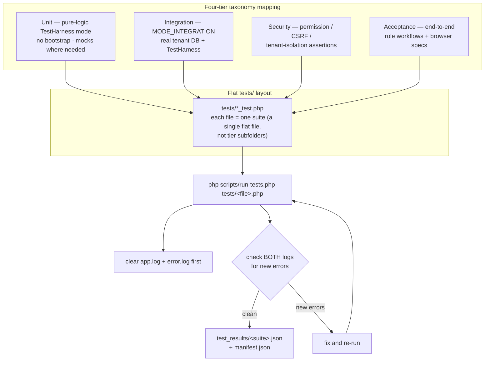

# Testing Conventions

## Test Lifecycle

Every test run follows the same lifecycle, from a clean log slate to a committed change. The two hard gates are **checking both logs** and **inspecting the JSON results** — never skip them.

1. **Clear both logs** — `storage/logs/app.log` and `storage/logs/error.log`. A stale log makes new errors indistinguishable from old ones.
2. **Write / extend the test** — pure-logic or `MODE_INTEGRATION` mode. Call `fingerprint()` on every source file under test and `gap()` for documented missing coverage.
3. **Run it** — `php scripts/run-tests.php tests/<file>.php` (or directly `php tests/<file>.php`).
4. **Gate — check both logs** for new errors. New entries in `app.log` or `error.log` mean the run is not clean: fix and re-run before inspecting results.
5. **Inspect `test_results/<suite>.json`** — per-assertion pass/fail, documented gaps, and source fingerprints — plus the aggregated `test_results/manifest.json`.
6. **State-machine coverage** — if the test exercises status transitions, use the N×N matrix pattern (every from→to combination) rather than ad hoc cases.
7. **Commit per logical change** — one commit per behavior change, not one giant commit at the end.



### Mapping the four-tier taxonomy onto the flat layout

The taxonomy in `.github/skills/testing-strategy.md` (unit / integration / security / acceptance) describes *intent*, not directory structure. Ikabud keeps a flat `tests/*_test.php` layout — one file per suite — so map tiers to behavior, not folders:

- **Unit** — pure-logic `TestHarness` mode (no bootstrap). Calculation math, permission rule evaluation, status transition validation.
- **Integration** — `TestHarness::MODE_INTEGRATION` against the tenant DB. Assert on real database state; use high test tenant IDs and clean up seed data.
- **Security** — permission, CSRF, and tenant-isolation assertions (cross-tenant access, unauthorized approval, direct URL access, upload validation, modification of approved records).
- **Acceptance** — end-to-end role workflows: admin create → configure → close; encoder submit → view; supervisor review → approve; plus browser/Playwright specs where UI is involved.

## Test Style
- Prefer plain PHP integration-style tests under `tests/` that bootstrap the app directly
- Avoid mocks where possible — test concrete behavior

## Shared Test Harness
Use `tests/harness/TestHarness.php` for all new tests. Module-agnostic, provides:
- `test()` / `assertSame()` / `assertThrows()` — assertion methods
- `section()` — group related assertions
- `gap()` — document missing coverage (included in JSON output)
- `fingerprint(path)` — record md5 of tested source files
- `done()` — writes `test_results/<suite>.json` + updates `manifest.json`

**Pure-logic mode** (no bootstrap):
```php
require_once __DIR__ . '/../harness/TestHarness.php';
$h = new TestHarness('my-suite');
$h->fingerprint('modules/my-module/services/Workflow.php');
$h->section('Transitions');
$h->test('draft → pending', $workflow::isAllowed('draft', 'pending'));
$h->done();
```

**Integration mode** (with tenant DB):
```php
$h = new TestHarness('my-suite', TestHarness::MODE_INTEGRATION, 'mytenant.test');
// app()->db() now connects to the tenant's database
```

## Before Each Test
- Clear `storage/logs/app.log` and `storage/logs/error.log`

## After Running Tests
- Always check **both** `storage/logs/app.log` and `storage/logs/error.log` — not just test output
- Check `test_results/<suite>.json` for structured pass/fail/gap detail
- Check `test_results/manifest.json` for aggregated view

## Assertion Patterns
- Assert on concrete behavior (response codes, database state, rendered output)
- Use `app()->dbForTenant()` or module DB patterns as appropriate for database assertions
- For tenant-specific modules, run migrations via `php ikabud tenant:migrate <tenant_id|tenant_key|domain> [module]`
- Always `fingerprint()` source files being tested
- Always `gap()` documented missing coverage
- Use `skip()` for intentionally deferred tests (they appear in the JSON)

## State Machine Tests (Exhaustive Matrix)
When testing status transitions, use an N×N matrix covering every from→to combination:
```php
$allStatuses = ['draft', 'pending', 'approved', ...];
foreach ($allStatuses as $from) {
    foreach ($allStatuses as $to) {
        $expected = in_array($to, $allowed[$from], true);
        $h->test("{$from} → {$to} = " . ($expected ? 'ALLOWED' : 'FORBIDDEN'),
            $service::isAllowed($from, $to) === $expected);
    }
}
```

## Integration Seed Data Pattern
```php
$testTenantId = 999901; // Use high ID to avoid conflicts
$cleanup = ['pal_projects', 'pal_clients', 'pal_users'];
foreach ($cleanup as $t) { $db->exec("DELETE FROM {$t} WHERE tenant_id = {$testTenantId}"); }

function seedProject(PDO $db, int $tid, ...): int {
    global $seedCounter;
    $seedCounter++;
    // Use $seedCounter in unique keys (project_id, job_order_number) to avoid UNIQUE violations
    $s = $db->prepare("INSERT INTO pal_projects (...) VALUES (...)");
    $s->execute([...]);
    return (int)$db->lastInsertId();
}
```
**Always clean up seed data** at the end of the test. Watch for: generated columns, ENUM values, NOT NULL defaults.

## Source Fingerprints
Every test must record the md5 of each source file it tests:
```php
$h->fingerprint('modules/my-module/services/Workflow.php');
```
This detects source changes without test updates — the hash mismatch is visible in `test_results/*.json`.

## Test Results Output
Each test run produces two artifacts:
- **stdout**: Human-readable with ✅❌⏭🔍 markers
- **JSON**: `test_results/<suite>.json` with per-assertion detail, gaps, source fingerprints

Aggregated manifest at `test_results/manifest.json`.

## Scaffold Generator
```bash
php scripts/generate-module-test.php <module-id> [--playwright]
```
Auto-generates stub files: manifest contract, state machine, integration, and Playwright specs.

## Playwright Browser Tests
Fixture at `tests/browser/WorkbenchFixture.js` — provides pre-authenticated page + component harnesses.

### Entity-List Selector Gotcha (Module-Agnostic)
`DefaultEntityRenderer` at `kernel/EntityContext/DefaultEntityRenderer.php:225` emits:
- `data-wb-component="responsive-table"` when `use="workbench"` AND `view="table"` (most PAL list pages)
- `data-wb-component="entity-list"` otherwise

**Do NOT** use `[data-wb-component="entity-list"]` alone — it silently misses every PAL list page (renders as `responsive-table`).

**Do** use a CSS union that matches both component types — this is **module-agnostic** and works for PAL, Guidance, WMS, EHR, or any module:
```javascript
await page.waitForSelector('[data-wb-component="entity-list"], [data-wb-component="responsive-table"]');

const list = page.locator('[data-wb-component="entity-list"], [data-wb-component="responsive-table"]');
await expect(list.first()).toBeVisible();
await expect(list.first()).toHaveAttribute('data-wb-entity');
```

The `data-wb-entity` value will be module-specific (e.g., `"pal_project"`, `"pal_expense"`, `"guidance_case"`)—assert on it only when testing a specific module.

PAL credentials: `ADMIN_USER=pAladmin ADMIN_PASS=pal123456` (note capital A in `pAladmin`).

### Current Coverage Priorities
1. Manifest-settings default contract tests across all settings-bearing modules
2. Ecommerce storefront media tests (featured image, gallery fallback, placeholder)
3. CMS entity-list product-card image tests for `/ecommerce/shop` rendering path
4. EHR entity-view integration tests for patient-registry, encounters, and scheduling (`entity.list/*` + `entity.get/*`)
5. Ticketing entity-view integration tests for `entity.list.ticket@1` and `entity.get.ticket@1`, including CMS list/detail rendering paths

## Test Runner
- PHP deps: `composer install` (repo root)
- Kernel tests (from `ikabud-kernel`): `composer test`
- Run individual test files directly: `php tests/<module>/<test>.php`
- Browser tests: `npx playwright test tests/browser/workbench/`
