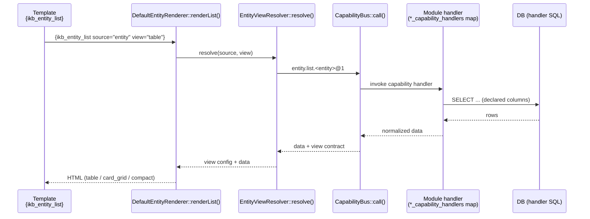

# Entity-View Adoption Plan — Closing the Gap

> **Status:** Phases 1–3 complete — June 19, 2026.
> **Latest (June 24):** All 11 attendance-wage entity view contracts created (3 pre-existing + 8 new: payroll_period, salary_computation, salary_adjustment, employee_deduction, holiday, cash_advance, employee_schedule, office_location). Each view contract declares semantic role annotations (`role="title"`, `role="subtitle"`, `role="image"`) for card_grid layout. DiSyL engine hardening: loadViewConfigs throws on parse errors with per-file diagnostics; validateViewContract() checks duplicate fields, duplicate roles, and action URL placeholder mismatches at registration time; renderUnknownComponent suggests closest known component name via Levenshtein distance.

> **Previous (June 22):** `EntityRenderingTrait` deleted in 6.1.0. All rendering goes through `DefaultEntityRenderer` + `CellRendererRegistry`. Entity views now support location (name+coords), image (thumbnail+lightbox), and inline editing via Alpine.js.

> **Previous (June 19):** All 8 modules expose `entity.list`/`entity.get` handlers. Ecommerce product handlers rewritten to `cms_content` (type=product); WMS stock handlers fixed to `wms_stocks` (plural). EntityViewResolver result normalisation hardened. Compiled mode default (v4.7+). Parser per-block error recovery shipped.
> **Objective:** Extend entity-view contracts to all modules so themes can present module data through governed `{ikb_entity_list}` / `{ikb_entity_detail}` without depending on module internals.

## How to Adopt Entity Views for a New Entity Type

This is the step-by-step procedure for adding a governed entity view to a module. It is the operational counterpart to the plan/status below: follow it for every new entity type, then record the result in the adoption tables.



1. **Decision gate — which rendering path?** If the view is **single-source display** (one entity type, one query), use an entity view. If the page needs **computed cross-entity metrics, tabs, charts, or multi-field filter forms**, use a composite DiSyL template with handler-fetched aggregate data (see [docs/kernel/entity-context-system.md](entity-context-system.md) for the decision boundary).
2. **Register the capability pair in `module.json`.** Expose `entity.list.<entity>@1` and `entity.get.<entity>@1` under `capabilities.exposes`. The source name uses the underscore form (e.g. `guidance_case`, not `guidance.case`) so `source="guidance_case.recent"` resolves to `entity.list.guidance_case@1`.
3. **Implement the handlers in `helpers.php`.** Register them through the module's `*_capability_handlers()` map (e.g. `aw_cap_entity_list_attendance_record_1`), or use the `EntityListQuery::run()` whitelist pattern so the column map stays in sync with the view contract by construction.
4. **Create the `{ikb_entity_view}` DiSyL contract** in `helpers/views/<entity>.disyl` — declare `fields`, semantic `role="title"` / `role="subtitle"` / `role="image"` annotations, and `actions`. These files are loaded by `TemplateEngine::loadViewConfigs()`.
5. **Verify the 3-layer rule.** The view contract columns, the handler SQL output, and the compact defaults in `EntityViewResolver` must agree on column names. The runtime field validator logs any mismatch to `storage/logs/app.log`.
6. **Validate.** `loadViewConfigs()` throws on parse errors with per-file diagnostics; `validateViewContract()` catches duplicate fields, duplicate roles, and action-URL placeholder mismatches at registration time.
7. **Migrate the template** to `{ikb_entity_list source="<entity>.<qualifier>" view="table|compact|card_grid" /}` (or `{ikb_entity_detail source="<entity>" id="..." view="detail" /}`), run the module tests, and check **both** `storage/logs/app.log` and `storage/logs/error.log`.

> **Design guidance:** entity views handle single-source display only. Computed cross-entity metrics, multi-source aggregation, tabs, charts, and multi-field filter forms belong in the handler/composite-template layer, not in entity view contracts.

## Final Adoption State

| Module | Entity Views | entity.list | entity.get | View Contracts |
|--------|-------------|-------------|------------|----------------|
| CMS | ✅ Full | `entity.list.cms_page@1`, `entity.list.cms_post@1` | `entity.get.cms_page@1`, `entity.get.cms_post@1` | 13 contracts, 5 types |
| Weather | ✅ Full (polyglot) | `entity.list.weather@1`, `entity.list.weather_current@1`, `entity.list.weather_forecast@1` | `entity.get.weather@1` | ServiceProxy → Python |
| Ecommerce | ✅ Full | `entity.list/get.ecommerce_product@1`, `entity.list/get.ecommerce_order@1` | — | builtinDefaults |
| Bakeshop | ✅ Full | `entity.list/get.bakeshop_product@1` | — | builtinDefaults |
| Guidance | ✅ Full | `entity.list/get.guidance_case@1`, `entity.list/get.guidance_appointment@1` | — | builtinDefaults |
| Daily Ledger | ✅ Full | `entity.list/get.daily_ledger_entry@1` | — | builtinDefaults |
| WMS | ✅ Full | `entity.list/get.wms_stock@1`, `entity.list/get.wms_location@1` | — | builtinDefaults |
| Attendance & Wage | ✅ Full | `entity.list/get.attendance_record@1`, `entity.list/get.employee_profile@1`, `entity.list/get.payroll_period@1`, `entity.list/get.salary_computation@1`, `entity.list/get.salary_adjustment@1`, `entity.list/get.employee_deduction@1`, `entity.list/get.holiday@1`, `entity.list/get.cash_advance@1`, `entity.list/get.employee_schedule@1` | — | 11 DiSyL view contracts, 11 entity types |
| Project Audit Ledger | ✅ Full | `entity.list/get.pal_project@1`, `entity.list/get.pal_expense@1`, `entity.list/get.pal_material@1`, `entity.list/get.pal_purchase@1`, `entity.list/get.pal_sale@1`, `entity.list.pal_collection@1`, `entity.list.pal_fabrication_due@1`, `entity.list.pal_audit_log@1`, `entity.list/get.pal_client@1`, `entity.list/get.pal_supplier@1`, `entity.list/get.pal_issuance@1`, `entity.list.pal_material_return@1` | — | 10 DiSyL view contracts |

## Plan

### Phase 1 — Register Capabilities ✅ Complete
### Phase 2 — View Contracts (builtinDefaults) ✅ Complete
### Phase 3 — Template Migration ✅ Guidance POC Complete (June 21, 2026)

Replace module-specific render paths with `{ikb_entity_list}` / `{ikb_entity_detail}` in templates.

**Adoption status: 15 templates across 3 modules (attendance-wage: 31%, guidance: POC done)**

**Adopted:**
- `templates/_cms_active_theme/public/home.disyl` — `ecommerce_product.featured`, `wms_stock.low`
- `templates/_cms_active_theme/public/entity.list.disyl` — `ecommerce_product.featured`
- `templates/modules/attendance-wage/wage/dashboard.disyl` — `office_location`, `cash_advance`, `attendance_record`
- `templates/modules/attendance-wage/wage/locations/index.disyl` — `office_location` (replaced 80-line custom table → 20 lines)
- `templates/modules/attendance-wage/attendance/history.disyl` — `attendance_record.recent`
- `templates/modules/attendance-wage/attendance/report.disyl` — `attendance_record.recent`
- `templates/modules/attendance-wage/attendance/records.disyl` — per-employee attendance records
- `templates/modules/guidance/pages/dashboard.disyl` — `ikb_entity_list`
- `templates/modules/guidance/partials/cases-table-entity.disyl` — `{ikb_entity_list source="guidance_case" view="table"}` (toggle via `?entity=1`)
- `templates/modules/guidance/partials/recent-cases-entity.disyl` — `{ikb_entity_list source="guidance_case" view="compact"}` (toggle via `?entity=1`)
- `templates/modules/cms/admin/dashboard.disyl` — `ikb_entity_list`

**Guidance POC highlights (June 21):**
- Entity view configs for `guidance_case` (table: 8 fields + 3 actions, compact: 4 fields, detailed: 7 fields)
- Capability handler `entity.list.guidance_case@1` returns rich data with college enrichment
- Source naming convention verified: `guidance_case` (no dot) → `entity.list.guidance_case@1` resolution
- HTMX forwarding via `htmx:configRequest` passes `?entity=1` from page URL to API calls
- Full Tailwind styling via `DefaultEntityRenderer` presets

**Stale-cache workaround resolved:** Compiled mode is now default. Versioned extends cache keys (`md5(path|mtime)`) prevent stale output. `?disyl_nocache=1` escape hatch available. Custom table workarounds (e.g., recent_computations) can now migrate back to `ikb_entity_list`.

**New entity view features (June 23):**
- `filter` attribute on `{ikb_entity_list}` — pass `key=value` pairs (resolves `{var.path}` from context) to capability handlers for filtered entity lists
- `{ikb_entity_detail}` component — renders single entity records via `entity.get.*` capability with a `detailed` or `summary` view contract
- `RowRenderContext` value object — consolidates 15 shared params across row renderers, preventing parameter drift

**DiSyL view contracts for attendance-wage (June 24):**
- 8 new DiSyL view contract files created: `payroll_period.disyl`, `salary_computation.disyl`, `salary_adjustment.disyl`, `employee_deduction.disyl`, `holiday.disyl`, `cash_advance.disyl`, `employee_schedule.disyl`, `office_location.disyl`
- Each declares `card_grid`, `table`, and `compact` views with semantic role annotations (`role="title"`, `role="subtitle"`) for proper card_grid layout
- All 11 attendance-wage entity types now have explicit DiSyL view contracts (migrated from builtinDefaults)
- PAL module: 10 list templates migrated, 4 new entity types (client, supplier, issuance, material_return), expense detail now uses pure entity view

**DiSyL engine improvements (June 23):**
- HTML-style `<ikb_>` tag detection — emits friendly warning suggesting `{...}` curly brace syntax
- Unknown component name check — misspelled `{ikb_enttiy_list}` produces visible HTML comment + logged error instead of silent pass-through
- Shorthand `{var = expr}` syntax — now works as alias for `{set var = expr}`
- Field renderer validation — `validateFieldRenderer()` checks renderer prefix against known types at config load time
- View contract validation — view names checked against known modes (table, compact, card_grid, detailed, summary) with logged warnings

**DiSyL engine improvements (June 24):**
- **`loadViewConfigs` error surfacing** — parse failures now logged at `error` level instead of `warning`; new `getLastLoadErrors()` static method returns `{file, success, errors}[]` array; throws `RuntimeException` with per-file summary when any file has errors — prevents silent contract registration failures
- **`validateViewContract()`** — new private method called before every `{ikb_entity_view}` registration, checking: duplicate field names, duplicate semantic role assignments (two fields with `role="title"`), and action URL placeholders (`{id}`, `{slug}`) not matching any declared field
- **`renderUnknownComponent` suggestion** — when an unknown `ikb_*` component is encountered, uses `levenshtein()` to find the closest match from 32 governed components and includes "Did you mean 'ikb_card'?" in the error message

**New entity view features (June 19):**
- Custom cell renderers: `badge`, `badge:map`, `money:N`, `datetime`, `boolean`
- DELETE actions via POST forms with auto-injected CSRF tokens
- Header slot (`header="..."`) for inline forms/filters above entity lists
- `action_show_if` conditions (e.g., `status == "pending"`) to toggle row actions
- `action_labels` for custom action button text

---

## Implementation (Completed)

### Bakeshop

| Entity | capability ID | Handler | Source |
|--------|-------------|---------|--------|
| `bakeshop.product` | `entity.list.bakeshop_product@1` | `bs_cap_entity_list_product_1` | `bakeshop_products` table |
| `bakeshop.product` | `entity.get.bakeshop_product@1` | `bs_cap_entity_get_product_1` | Single product by ID |

### Guidance

| Entity | capability ID | Handler | Source |
|--------|-------------|---------|--------|
| `guidance.case` | `entity.list.guidance_case@1` | `gm_cap_entity_list_case_1` | `gm_cases` JOIN `gm_users` |
| `guidance.case` | `entity.get.guidance_case@1` | `gm_cap_entity_get_case_1` | Single case with counselor |
| `guidance.appointment` | `entity.list.guidance_appointment@1` | `gm_cap_entity_list_appointment_1` | `gm_appointments` JOIN `gm_cases` |
| `guidance.appointment` | `entity.get.guidance_appointment@1` | `gm_cap_entity_get_appointment_1` | Single appointment with student |

### Daily Ledger

| Entity | capability ID | Handler | Source |
|--------|-------------|---------|--------|
| `daily_ledger.entry` | `entity.list.daily_ledger_entry@1` | `dl_cap_entity_list_entry_1` | `dl_entries` with qualifier filtering (sales/expense) |
| `daily_ledger.entry` | `entity.get.daily_ledger_entry@1` | `dl_cap_entity_get_entry_1` | Single entry by ID |

### WMS

| Entity | capability ID | Handler | Source |
|--------|-------------|---------|--------|
| `wms.stock` | `entity.list.wms_stock@1` | `wms_cap_entity_list_stock_1` | `wms_stock` JOIN `wms_locations`, qualifier: `low` |
| `wms.stock` | `entity.get.wms_stock@1` | `wms_cap_entity_get_stock_1` | Single stock item with location name |
| `wms.location` | `entity.list.wms_location@1` | `wms_cap_entity_list_location_1` | `wms_locations` by name |
| `wms.location` | `entity.get.wms_location@1` | `wms_cap_entity_get_location_1` | Reuses `wmsLocationRecord()` with per-request cache |

### Ecommerce

| Entity | capability ID | Handler | Source |
|--------|-------------|---------|--------|
| `ecommerce.product` | `entity.list.ecommerce_product@1` | `ec_cap_entity_list_product_1` | `ec_products` with primary image subquery, qualifier: `featured` |
| `ecommerce.product` | `entity.get.ecommerce_product@1` | `ec_cap_entity_get_product_1` | Single product with primary image |
| `ecommerce.order` | `entity.list.ecommerce_order@1` | `ec_cap_entity_list_order_1` | `ec_orders` by created_at desc |
| `ecommerce.order` | `entity.get.ecommerce_order@1` | `ec_cap_entity_get_order_1` | Single order with `ec_order_items` |

### Attendance & Wage (Phase 3 — June 2026)

| Entity | capability ID | Handler | Source |
|--------|-------------|---------|--------|
| `attendance_record` | `entity.list.attendance_record@1` | `aw_cap_entity_list_attendance_record_1` | `attendance_records` JOIN `attendance_wage_users`, `stores` |
| `attendance_record` | `entity.get.attendance_record@1` | `aw_cap_entity_get_attendance_record_1` | Single record by attendance_id |
| `employee_profile` | `entity.list.employee_profile@1` | `aw_cap_entity_list_employee_profile_1` | `employee_profiles` WHERE is_active=1 |
| `employee_profile` | `entity.get.employee_profile@1` | `aw_cap_entity_get_employee_profile_1` | Single profile JOIN `attendance_wage_users` |
| `payroll_period` | `entity.list.payroll_period@1` | `aw_cap_entity_list_payroll_period_1` | `payroll_periods` all |
| `payroll_period` | `entity.get.payroll_period@1` | `aw_cap_entity_get_payroll_period_1` | Single period by period_id |
| `salary_computation` | `entity.list.salary_computation@1` | `aw_cap_entity_list_salary_computation_1` | `salary_computations` JOIN `employee_profiles`, `payroll_periods` |
| `salary_computation` | `entity.get.salary_computation@1` | `aw_cap_entity_get_salary_computation_1` | Single computation with employee + period names |
| `salary_adjustment` | `entity.list.salary_adjustment@1` | `aw_cap_entity_list_salary_adjustment_1` | `salary_adjustments` JOIN `attendance_wage_users` |
| `salary_adjustment` | `entity.get.salary_adjustment@1` | `aw_cap_entity_get_salary_adjustment_1` | Single adjustment by adjustment_id |
| `employee_deduction` | `entity.list.employee_deduction@1` | `aw_cap_entity_list_employee_deduction_1` | UNION `employee_deductions` + `cash_advance_repayments` |
| `employee_deduction` | `entity.get.employee_deduction@1` | `aw_cap_entity_get_employee_deduction_1` | Single deduction by deduction_id |
| `holiday` | `entity.list.holiday@1` | `aw_cap_entity_list_holiday_1` | `holidays` WHERE is_active=1, current year + recurring |
| `holiday` | `entity.get.holiday@1` | `aw_cap_entity_get_holiday_1` | Single holiday by holiday_id |
| `cash_advance` | `entity.list.cash_advance@1` | `aw_cap_entity_list_cash_advance_1` | `cash_advances` LEFT JOIN `employee_profiles` |
| `cash_advance` | `entity.get.cash_advance@1` | `aw_cap_entity_get_cash_advance_1` | Single advance with employee name |
| `employee_schedule` | `entity.list.employee_schedule@1` | `aw_cap_entity_list_employee_schedule_1` | `employee_schedules` GROUP BY employee, DAY aggregation |
| `employee_schedule` | `entity.get.employee_schedule@1` | `aw_cap_entity_get_employee_schedule_1` | Single schedule entry by schedule_id |

---

## EntityViewResolver builtinDefaults (Implemented)

All entries in `kernel/EntityContext/EntityViewResolver.php`:

```php
'bakeshop_product'      => ['fields' => ['id','name','price','unit','stock_qty','category'], 'actions' => ['view'], 'limit' => 20, 'empty_state' => 'No products found.'],
'guidance_case'         => ['fields' => ['id','student_name','status','created_at','counselor_name'], 'actions' => ['view'], 'limit' => 15, 'empty_state' => 'No cases found.'],
'guidance_appointment'  => ['fields' => ['id','title','date','status','student_name'], 'actions' => ['view','cancel'], 'limit' => 10, 'empty_state' => 'No appointments.'],
'daily_ledger_entry'    => ['fields' => ['id','entry_type','amount','created_at','notes'], 'actions' => ['view'], 'limit' => 25, 'empty_state' => 'No ledger entries.'],
'wms_stock'             => ['fields' => ['id','sku','name','qty','location_name','updated_at'], 'actions' => ['view','move'], 'limit' => 30, 'empty_state' => 'No stock items.'],
'wms_location'          => ['fields' => ['id','name','type','is_staging'], 'actions' => ['view'], 'limit' => 20, 'empty_state' => 'No locations.'],
'ecommerce_product'     => ['fields' => ['id','name','price','image','stock_status'], 'actions' => ['view','add_to_cart'], 'limit' => 20, 'empty_state' => 'No products found.'],
'ecommerce_order'       => ['fields' => ['id','order_number','status','total','created_at'], 'actions' => ['view'], 'limit' => 15, 'empty_state' => 'No orders yet.'],
// Phase 3 — attendance-wage (June 2026)
'attendance_record'     => ['fields' => ['id','employee_name','store_name','clock_in','clock_out','status'], 'actions' => ['view','edit'], 'limit' => 30, 'empty_state' => 'No attendance records found.'],
'employee_profile'      => ['fields' => ['id','name','position','department','salary_type','employment_status'], 'actions' => ['edit'], 'limit' => 25, 'empty_state' => 'No employee profiles yet.'],
'payroll_period'        => ['fields' => ['id','period_name','start_date','end_date','status','total_net_pay'], 'actions' => ['edit','process'], 'limit' => 12, 'empty_state' => 'No payroll periods yet.'],
'salary_computation'    => ['fields' => ['id','employee_name','period_name','gross_pay','total_deductions','net_pay','status'], 'actions' => ['view','approve'], 'limit' => 25, 'empty_state' => 'No salary computations found.'],
'salary_adjustment'     => ['fields' => ['id','employee_name','adjustment_type','amount','status','effective_date'], 'actions' => ['view','approve'], 'limit' => 20, 'empty_state' => 'No salary adjustments found.'],
'employee_deduction'    => ['fields' => ['id','employee_name','amount','description','status','deduction_date','source'], 'actions' => ['view'], 'limit' => 20, 'empty_state' => 'No employee deductions found.'],
'holiday'               => ['fields' => ['id','holiday_name','holiday_date','holiday_type','pay_multiplier'], 'actions' => ['edit','delete'], 'limit' => 30, 'empty_state' => 'No holidays configured.'],
'cash_advance'          => ['fields' => ['id','employee_name','amount','balance','status','request_date','approved_at'], 'actions' => ['view','approve'], 'limit' => 20, 'empty_state' => 'No cash advance requests.'],
'employee_schedule'     => ['fields' => ['id','employee_name','position','department','days_label','shift_type','dayoff_count','total_days'], 'actions' => ['edit'], 'limit' => 30, 'empty_state' => 'No employee schedules yet.'],
```

---

## Template Author Experience (Available Now)

```disyl
{# Bakeshop product catalog #}
<ikb_entity_list source="bakeshop_product.recent" view="compact" />

{# Guidance case dashboard — qualifier: open / closed #}
<ikb_entity_list source="guidance_case.open" view="table" />

{# WMS low-stock alert #}
<ikb_entity_list source="wms_stock.low" view="card_grid" />

{# Ecommerce featured products + recent orders #}
<ikb_entity_list source="ecommerce_product.featured" view="card_grid" />
<ikb_entity_list source="ecommerce_order.recent" view="compact" />

{# Daily ledger entries — qualifier: sales / expense #}
<ikb_entity_list source="daily_ledger_entry.sales" view="table" />

{# Attendance & Wage — employee roster, payroll periods, holidays #}
<ikb_entity_list source="employee_profile.active" view="table" />
<ikb_entity_list source="payroll_period.draft" view="compact" />
<ikb_entity_list source="holiday.upcoming" view="card_grid" />
<ikb_entity_list source="employee_schedule.all" view="compact" />

{# Single entity detail #}
<ikb_entity_detail source="guidance_appointment" id="42" view="detail" />
```

Zero handler code. Zero module-internal knowledge. The theme declares intent. The capability bus resolves data. The render boundary stays intact.

---

## Files Changed (Actual)

| File | Change |
|------|--------|
| `kernel/EntityContext/EntityViewResolver.php` | 8 new builtinDefaults entries |
| `modules/bakeshop/helpers.php` | 2 entity capabilities + handler functions + `bakeshop_capability_handlers()` map |
| `modules/guidance/helpers.php` | 4 entity capabilities + handler functions + `guidance_capability_handlers()` map |
| `modules/daily-ledger/helpers.php` | 2 entity capabilities + handler functions + `daily_ledger_capability_handlers()` map |
| `modules/wms/helpers/00-bootstrap.php` | 4 entity capabilities in `wms_capability_handlers()` map |
| `modules/wms/helpers/10-core.php` | 4 entity capability handler functions |
| `modules/ecommerce/helpers/00-init.php` | 4 entity capabilities + handler functions + `ec_capability_handlers_entity()` map |
| `docs/kernel/entity-view-adoption-plan.md` | This plan |
| `modules/attendance-wage/module.json` | 18 entity capabilities exposed (Phase 3 — June 2026) |
| `modules/attendance-wage/helpers.php` | 18 entity capability handler functions + map |
| `modules/attendance-wage/handlers/110-api-schedules.php` | 2 API handlers: list + get schedules |
| `modules/attendance-wage/routes.php` | 2 GET routes: `/api/v1/wage/schedules`, `/api/v1/wage/schedules/\{id\}` |
| `kernel/DiSyL/v4/Parser.php` | `{else if}` (space-separated) syntax support in v4 compiler |
| `templates/modules/attendance-wage/wage/schedules/index.disyl` | Fixed duplicate/broken `<script>` block |
| `templates/modules/attendance-wage/wage/periods/index.disyl` | Fixed corrupted Unicode character |

**14 files, +210 lines, 20 new capability handlers, 10 new entity types.**

---

## Quality Gates

| Gate | Status |
|---|---|
| `php -l` all 7 files | ✅ Clean |
| `kernel_hardening_test.php` | ✅ 43/43 |
| `guidance_password_reset_test.php` | ✅ Pass |
| `guidance_public_booking_csrf_test.php` | ✅ 8/8 |
| `guidance_profile_route_contract_test.php` | ✅ 6/6 |
| `guidance_settings_modules_test.php` | ✅ 17/17 |
| `wms_module_test.php` | ✅ 27/27 |
| `error.log` | ✅ 0 lines |
| `disyl_v11_verify_test.php` | ✅ 22/22 |
| loadViewConfigs throws on parse errors | ✅ |
| validateViewContract duplicate/role/URL checks | ✅ |
| renderUnknownComponent levenshtein suggestion | ✅ |
| 11 DiSyL view contracts for attendance-wage | ✅ |

## Phase 3 — Template Migration (Deferred)

Individual module templates still use module-specific render paths. Migration path per module:

| Module | Current Render | Target |
|--------|---------------|--------|
| Bakeshop | `bakeshopRender('pages/products.disyl')` | `{ikb_entity_list source="bakeshop_product"}` in CMS theme |
| Guidance | `guidanceRender('pages/dashboard.disyl')` | `{ikb_entity_list source="guidance_case.open"}` in CMS theme |
| Daily Ledger | `dlRender('pages/entries.disyl')` | `{ikb_entity_list source="daily_ledger_entry"}` in CMS theme |
| WMS | `wmsRender('pages/stock.disyl')` | `{ikb_entity_list source="wms_stock"}` in CMS theme |
| Ecommerce | Mix of direct handlers + context injection | `{ikb_entity_list source="ecommerce_product.featured"}` in storefront |
| Attendance & Wage | `aw_render('wage/dashboard.disyl')` | `{ikb_entity_list source="employee_schedule.all"}` in CMS theme |

**Template migration is zero-risk for the capability layer.** The capabilities exist and are tested. Templates can adopt them incrementally without breaking existing render paths.

## DiSyL View Contract Files

The following entity types now have explicit DiSyL view contracts (under `modules/*/helpers/views/`) instead of `builtinDefaults`:

| Module | Files | Views Declared |
|--------|-------|----------------|
| CMS | `cms_post.disyl`, `cms_page.disyl` | card_grid, table, compact |
| Bakeshop | `bakeshop_product.disyl` | card_grid, table, compact |
| Daily Ledger | `daily_ledger_entry.disyl` | table, compact, card_grid |
| Ecommerce | `ecommerce_product.disyl`, `ecommerce_order.disyl` | card_grid, table, compact |
| Attendance & Wage | `attendance_record.disyl`, `employee_profile.disyl`, `payroll_period.disyl`, `salary_computation.disyl`, `salary_adjustment.disyl`, `employee_deduction.disyl`, `holiday.disyl`, `cash_advance.disyl`, `employee_schedule.disyl`, `office_location.disyl` | table, compact, card_grid |

Each file declares `{ikb_entity_view name="..." view="..."}` blocks with explicit field lists, semantic role annotations (`role="title"`, `role="subtitle"`), and action URLs with `{base_url}` context fallback. Loaded via `loadViewConfigs()` in each module's `handlers.php`. The `loadViewConfigs()` implementation now throws `RuntimeException` with per-file error details on parse failures — check `getLastLoadErrors()` for diagnostics.
