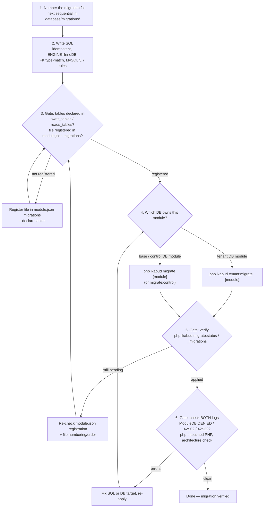

# Migration Workflow

> **Canonical flow for creating and applying database migrations in Ikabud.**
> Covers file numbering, SQL authoring rules (MySQL 5.7 / Compatibility profile), registration in `module.json`,
> the base-vs-tenant DB decision, verification, and the safe ALTER TABLE pattern.

**Last updated:** 2026-08-05

---

## Overview

Ikabud migrations are sequential SQL files, discovered per module from `module.json` and applied through the
kernel `MigrationRunner`. Because Ikabud is multi-tenant, a migration must be applied against the **correct**
database: the base/control DB for kernel-level or app-owned modules, or each tenant DB for tenant-local modules.

This document defines the **canonical migration flow**:

- A **numbered end-to-end flow** (Input → Process → Output).
- A **decision gate** for base/control DB vs. tenant DB.
- The **"Nothing to migrate"** gotcha (unregistered migration).
- The MySQL 5.7 / Compatibility-profile rules (see [Database Profiles](database-profiles.md)).

**Entry point:** a schema change you need to make.
**Exit point:** a migration applied to the right database(s), verified by status + logs + `architecture:check`.

---

## The Migration Flow

### 1. Number the migration file (next sequential)

Place the file in `database/migrations/` using the next sequential number for your module's series:

```
database/migrations/
├── 001_cms_core.sql
├── 002_cms_blocks_json.sql
├── ...
└── 023_your_new_change.sql   ← next sequential
```

- List the directory first to confirm the next number: `ls database/migrations/`
- Kernel/base migrations live alongside module ones but are named for their owner (e.g. `007_kernel_workflow_tables.sql`).
- Two migrations may share a prefix number (e.g. `007_tenant_module_settings.sql`) when they target different databases/modules; keep ordering deterministic within a module's own series.

### 2. Write SQL (idempotent; MySQL 5.7 rules)

Author the SQL so it can run against an existing install safely:

- **Idempotent**: guard columns/tables. **MySQL 5.7 does not support
  `ALTER TABLE ... ADD COLUMN IF NOT EXISTS`** — perform an
  `INFORMATION_SCHEMA.COLUMNS` / `INFORMATION_SCHEMA.TABLES` pre-check (or rely
  on the migration-runner's per-file guard) so a re-run never fails or corrupts
  an existing install.
- **MySQL 5.7 / Compatibility profile rules** (production target is Bluehost shared hosting — see [Database Profiles](database-profiles.md)):
  - Every `CREATE TABLE` must end with:
    ```sql
    ENGINE=InnoDB DEFAULT CHARSET=utf8mb4 COLLATE=utf8mb4_unicode_ci
    ```
  - **FK column types must match the referenced column exactly** (signedness + width). A `BIGINT UNSIGNED` column cannot reference an `INT UNSIGNED` column.
  - **No** window functions (`COUNT(*) OVER()`, `ROW_NUMBER() OVER()`, …), **no** CTEs (`WITH ... AS (...)`), **no** `JSON_TABLE()`, **no** `CHECK` constraints, **no** `EXCEPT`/`INTERSECT`.
  - Use `SET FOREIGN_KEY_CHECKS = 0` / `= 1` around cross-module `CREATE TABLE` statements where the referenced table may not exist yet.
- See the **MySQL 5.7 compatibility checklist** at the end of this doc.

### 3. Gate — declare tables + register in `module.json`

Every module owns/reads tables and lists its migrations in `module.json`:

```jsonc
{
  "owns_tables": [
    "your_module_items",          // tables this module creates
    "your_module_meta"
  ],
  "reads_tables": [
    "audit_logs"                  // tables from other owners you read
  ],
  "migrations": [
    "database/migrations/001_your_module_core.sql",
    "database/migrations/002_your_module_change.sql"   // ← add your new file here
  ]
}
```

- Add every new table to `owns_tables` (or `reads_tables` if you only read someone else's table).
- Add the new file path to `migrations`.
- **"Nothing to migrate" usually means the migration was never registered in `module.json`.** The `MigrationRunner` only sees files listed there — an unregistered file is silently ignored, and the CLI reports `Nothing to migrate.` Treat that message as a registration gate, not a success signal.

### 4. Apply — decision: tenant DB vs. base/control DB

| Module is owned by… | Apply with | Targets |
|---|---|---|
| A **tenant** database (tenant-local module, e.g. bakeshop/guidance/wms) | `php ikabud tenant:migrate <tenant_id\|tenant_key\|domain> [module]` | That tenant's own DB |
| The **base/control** application (kernel or app-owned module) | `php ikabud migrate [module]` | Primary app DB (`app()->db()`) / control DB (`migrate:control`) |

```bash
# Base/control DB — whole app, or a single module
php ikabud migrate
php ikabud migrate cms

# Tenant DB — select by id, tenant_key, or domain; optionally filter to one module
php ikabud tenant:migrate 3 bakeshop
php ikabud tenant:migrate zdnorte.net
php ikabud tenant:migrate mytenant-key
```

> **Never assume `app()->db()` is the right migration target.** For modules owned by separate tenant databases,
> use `php ikabud tenant:migrate` (it routes through `app()->dbForTenant($tenantId)` /
> `syncTenantCliMigrationsForTenant()`). A tenant-local module that reports `42S02` (missing table) against the
> **primary** app DB while its tenant DB is healthy is a stale base `_migrations` problem — verify the tenant
> record in `kernel_tenants` / `kernel_tenant_db_connections`, then migrate the tenant DB directly.

### 5. Gate — verify `migrate:status` / `_migrations`

Confirm the migration actually applied:

```bash
php ikabud migrate:status               # all modules — pending vs. applied
php ikabud migrate:status cms           # per-module applied + pending
```

- Applied rows are tracked in the `_migrations` table (batched, with `executed_at`).
- If a file still shows as **pending**, re-check `module.json` registration (Step 3) and that the number/order is correct.

### 6. Gate — logs, `php -l`, `architecture:check`

- **Check BOTH logs** — `storage/logs/app.log` and `storage/logs/error.log` — for:
  - `ModuleDB DENIED` — a query touched a table not in the module's `owns_tables`/`reads_tables`
  - `42S02` (table missing) / `42S22` (column missing) — wrong DB target, stale base `_migrations`, or FK/type mismatch
- Run `php -l` on any PHP you touched (services, handlers, helpers).
- Run the cross-module audit:
  ```bash
  php ikabud architecture:check
  ```
  This catches table/capability/template boundary violations introduced by the change.

---

## Safe ALTER TABLE Pattern

Never blindly `ALTER TABLE ... ADD COLUMN ... NOT NULL` on a populated table — the ALTER will fail or corrupt data if existing rows can't satisfy the constraint. Use one of:

### Option A — add column, then tighten (preferred for additive columns)

```sql
-- 1. Add the column as nullable (or with a safe default)
ALTER TABLE your_module_items
  ADD COLUMN status VARCHAR(20) NULL;

-- 2. Backfill existing rows before adding to SELECT lists as NOT NULL
UPDATE your_module_items SET status = 'active' WHERE status IS NULL;

-- 3. Only after data is populated, tighten the column
ALTER TABLE your_module_items
  MODIFY COLUMN status VARCHAR(20) NOT NULL DEFAULT 'active';
```

Order matters: **add column → backfill → add to SELECTs → then make NOT NULL.** Your services/queries should reference the new column only after the backfill step so reads never hit a partially-populated `NOT NULL` column.

### Option B — copy-table pattern (for structural rewrites)

```sql
CREATE TABLE your_module_items_new (
  id BIGINT UNSIGNED NOT NULL AUTO_INCREMENT,
  ... (full new shape) ...
  PRIMARY KEY (id),
  CONSTRAINT fk_your_module_items_xxx FOREIGN KEY (xxx) REFERENCES ... (id)
) ENGINE=InnoDB DEFAULT CHARSET=utf8mb4 COLLATE=utf8mb4_unicode_ci;

INSERT INTO your_module_items_new (id, col1, col2) SELECT id, col1, col2 FROM your_module_items;

DROP TABLE your_module_items;
RENAME TABLE your_module_items_new TO your_module_items;
```

> Use the copy-table pattern when changing PK/FK shape or adding a `NOT NULL` column that can't be backfilled in place. Wrap in `SET FOREIGN_KEY_CHECKS = 0` / `= 1` if other modules reference the table.

> **⚠️ Structural rewrites are disruptive — do not run this pattern in
> production without safeguards.** `DROP TABLE` + `RENAME TABLE` replace the
> table in place; require all of the following first:
>
> - **Verified backup** of the affected table(s) and dependents, tested to restore;
> - **Staging run** against a copy of the production data before touching production;
> - **Maintenance mode / write lock** so no writes interleave between `DROP` and `RENAME`;
> - **Foreign-key dependency review** — other modules/tables that reference this
>   table must tolerate the window where the table is absent (or be locked too);
> - **Explicit rollback steps** — keep the old table (rename to `..._old` and
>   verify before dropping) so a failed rewrite can be reverted.
>
> Prefer additive migrations (Option A) whenever the change can be expressed as
> add column → backfill → make NOT NULL. Use Option B only for true structural
> rewrites, and treat it as a maintenance-window operation.

---

## MySQL 5.7 Compatibility Checklist

> Applies to the **Compatibility profile** (production target: Bluehost shared hosting). See [Database Profiles](database-profiles.md). When Bluehost upgrades to MySQL 8.0+, switch to the Enterprise profile and unlock the gated features.

- [ ] `grep -rn "OVER()" modules/ src/ kernel/` returns nothing
- [ ] `grep -rn "WITH.*AS\s*(" modules/ src/ kernel/ --include="*.php"` returns nothing (non-CTE uses like `WITH GRANT OPTION` are fine)
- [ ] Every migration `CREATE TABLE` ends with `ENGINE=InnoDB DEFAULT CHARSET=utf8mb4 COLLATE=utf8mb4_unicode_ci`
- [ ] FK column types match referenced column types exactly (signedness + width)
- [ ] No `JSON_TABLE()`, `EXCEPT`, `INTERSECT` in queries
- [ ] `SET FOREIGN_KEY_CHECKS = 0/1` wraps cross-module `CREATE TABLE` statements
- [ ] Migration file is registered in `module.json` → `migrations`
- [ ] New tables listed in `owns_tables` (read-only access to others listed in `reads_tables`)
- [ ] Applied via the correct target: `tenant:migrate` for tenant DBs, `migrate` for base/control
- [ ] `php ikabud migrate:status` shows it applied (or `_migrations` has the row)
- [ ] Both logs clean; `php -l` passes on touched PHP; `php ikabud architecture:check` passes

---

## Diagram



---

## Troubleshooting

| Symptom | Likely Cause | Fix |
|---|---|---|
| `Nothing to migrate.` | Migration not registered in `module.json` → `migrations` | Add the file path to the `migrations` array, re-run |
| `42S02` table missing on the primary app DB (tenant module healthy) | Stale base `_migrations` / wrong DB target | Migrate the tenant DB via `php ikabud tenant:migrate <tenant> [module]` |
| `ModuleDB DENIED` | Query touches a table not in `owns_tables`/`reads_tables` | Declare the table in `module.json`, re-run `architecture:check` |
| `42S22` unknown column | Column added to SELECT before the migration backfilled/created it | Follow the safe ALTER TABLE pattern; re-apply |
| FK constraint failure on `CREATE TABLE` | Referenced table may not exist yet, or type mismatch | `SET FOREIGN_KEY_CHECKS=0/1` around cross-module statements; match types exactly |
| Migration runs but a module feature errors | Migration applied to wrong DB (base vs tenant) | Re-check the decision table in Step 4 |

---

## References

- [Database Compatibility Profiles](database-profiles.md)
- [Production Deployment Guide — migration step](production-deployment-guide.md)
- [CLI Tools Reference](cli-tools-reference.md) — `migrate`, `tenant:migrate`, `migrate:status`, `migrate:control`, `architecture:check`
- [Module Manifest Schema](module-manifest-schema.md) — `owns_tables`, `reads_tables`, `migrations`
