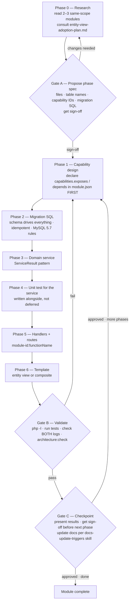
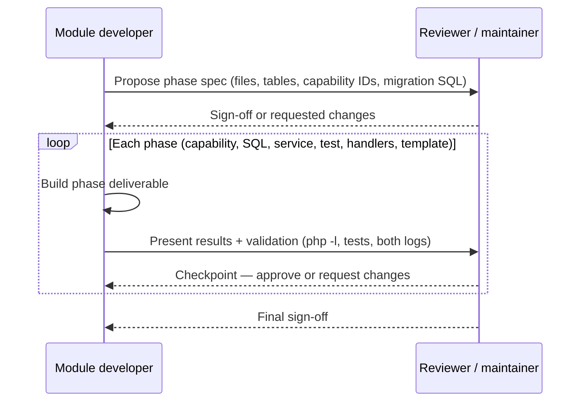

# Module Development Guide — Ikabud Kernel

This guide explains how to build, package, and install modules for the Ikabud Kernel OS (Ikabud Kernel + DiSyL).

> **New to module development?** Start with the [Module Quickstart Tutorial](module-quickstart.md) — build a working module in 30 minutes, then come back here for the full reference.
>
> **Need to integrate with other modules?** See the [Cross-Module Interaction Playbook](cross-module-playbook.md) — decision tree for events, capabilities, triggers, and hooks.

> **⚠️ Canonical source:** This file is the single source of truth for module development. An older, orphaned `module-developer-guide.md` exists in this folder with **conflicting handler signatures** (e.g. `my_modulePageDashboard(ModuleContext $ctx)` vs the canonical `handleMyPage(array $params = [])`). Follow **this** guide — treat `module-developer-guide.md` as legacy.

---

## The Module Lifecycle

Every module — from a small CMS sub-module to a full product suite — is built through the same **gated, per-phase loop**. You stop for sign-off at the phase-spec proposal (Gate A), after validation (Gate B), and before starting the next phase (Gate C).

Do not skip or reorder phases. Three rules are non-negotiable:

1. **Capabilities are designed first.** Declare `capabilities.exposes` / `capabilities.depends` in `module.json` *before* writing routes or handlers.
2. **Migration SQL drives everything.** Schema comes before service logic, not after.
3. **The service unit test is written alongside the service** — never deferred to "later".



### Phase 0 — Research

Study **2–3 existing modules with similar scope** (`module.json`, `routes.php`, `handlers.php`, helpers pattern). If the module will expose list/detail views, consult the [Entity-View Adoption Plan](entity-view-adoption-plan.md) and [the 3-layer rule in the DiSyL quickstart](../disyl/quickstart.md#the-3-layer-rule) before designing capabilities.

### Gate A — Propose phase spec

List the files, key decisions, and migration SQL for the phase. Include **capability IDs** and **table names**. Get sign-off before writing code.

### Phase 1 — Capability design

Declare `capabilities.exposes` / `capabilities.depends` in `module.json` **first**, then implement handler functions in `helpers.php` via a `*_capability_handlers()` map — see `bakeshop`, `guidance`, and `wms` for the established pattern.

### Phase 2 — Migration SQL

Schema drives everything. Write **idempotent** migrations (`IF NOT EXISTS`, `information_schema` guards for `ALTER TABLE`) and follow the Bluehost / MySQL 5.7 compatibility rules (InnoDB, matching FK column types, no window functions or CTEs). See [Database Migrations](#database-migrations).

### Phase 3 — Domain service

Put business logic in a domain service that returns `ServiceResult`. Follow the [service layer patterns](../../.github/skills/service-layer-patterns.md) skill — transaction discipline, event emission, audit logging.

### Phase 4 — Unit test for the service

Write the service unit test **alongside** the service (pure-logic `TestHarness` mode — no bootstrap). Do not defer it. See the [testing conventions](../../.github/instructions/testing-conventions.instructions.md).

### Phase 5 — Handlers + routes

Add handler functions and wire them in `routes.php` with `module-id:functionName` references. Keep the route map declarative; put request logic in handlers/services.

### Phase 6 — Template

Render via entity view (`{ikb_entity_list}` / `{ikb_entity_detail}`) for single-source display, or a composite DiSyL template for dashboards / multi-source pages. See [Entity-View Adoption Plan](entity-view-adoption-plan.md) for the decision boundary.

### Gate B — Validate

Run `php -l` on every touched file, run the module tests, check **both** `storage/logs/app.log` and `storage/logs/error.log`, and run `php ikabud architecture:check`.

### Gate C — Checkpoint

Present the results and get sign-off before starting the next phase. The **final step of the checkpoint is to update docs per the `docs-update-triggers` skill**, so code and documentation stay in sync.



---

## Activation Before Participation — Kernel Invariant

> **Presence is not activation. Installation is not activation. Capability registration is not permission to surface UI.**

A non-core module that is discovered and installed but NOT explicitly activated for the current tenant MUST NOT participate in the host application's runtime surface. This invariant is enforced at the kernel boundary — the Capability Bus, hook dispatch, route resolution, and UI-contribution rendering all consult `moduleIsActive()` before allowing a module to participate.

### The lifecycle states

| State | Meaning | `moduleIsActive()` | `isModuleEnabled()` |
|---|---|---|---|
| **Discovered** | Kernel knows the module exists on disk | `false` | `true` (by default) |
| **Active** | Tenant admin has explicitly activated the module (`_module_enabled: true` in tenant settings), OR the module is in the entry module's narrow always-active closure (see below) | `true` | `true` |
| **Inactive** | Module is installed and enabled but NOT explicitly activated | `false` | `true` |
| **Disabled** | Module is disabled (`_module_enabled: false` or globally disabled) | `false` | `false` |

### The rule

```
Module discovered → available to kernel registry
Module installed → schema/assets/config available
Module ACTIVATED → capabilities serve calls, hooks participate, routes accessible, UI contributions visible
```

Deactivation reverses participation without destroying data (`_module_enabled: false`). The module remains installed and retains its database/configuration.

### Declaration Before Integration

> **Cross-module capability calls are architectural decisions, not implementation conveniences.**

A module that is active may interact with another module only through an explicitly declared and enabled integration contract. Capability discovery alone never grants integration authority.

The integration contract is declared in `module.json`:

```json
{
  "integrations": {
    "wms": {
      "type": "optional",
      "uses": [
        "wms.stock.reserve@1",
        "wms.stock.release@1"
      ],
      "adds_features": [
        "warehouse_inventory",
        "stock_reservation"
      ]
    }
  }
}
```

A provider capability may carry `require_integration: true` in its expose entry:

```json
{
  "capabilities": {
    "exposes": [
      { "id": "wms.stock.reserve@1", "require_integration": true }
    ]
  }
}
```

When set, the Capability Bus rejects calls from callers that have not declared an integration for that capability from that provider. Modules that do not set `require_integration` remain backward compatible.

Combined rule:
> **Activation Before Participation. Declaration Before Integration.**
> A module must be active before it can participate in the runtime. An active module may interact with another module only through an explicitly declared and enabled integration contract. Capability discovery alone never grants integration authority.

#### Scaffolding declares the integration contract up front

`make:module` is integration-aware: when a module is created it must identify **which existing modules add to its capabilities** and declare the relationship. This bakes "Declaration Before Integration" into the creation flow instead of leaving it as an afterthought.

```bash
php ikabud make:module shop \
  --depends=cms \
  --uses=wms.stock.reserve,wms.stock.release \
  --integration="wms:wms.fulfillment.create" \
  --integration-features="wms:warehouse_inventory,stock_reservation,fulfillment" \
  --integration-required=wms
```

| Flag | Meaning |
|---|---|
| `--depends=<a,b>` | Module-level hard `depends` (the module cannot boot without these). |
| `--uses=<cap,...>` | Capabilities the module will call. Added to `capabilities.depends` and, when a provider module is discoverable, to that provider's integration `uses` (auto-resolved to the exposed versioned id, e.g. `wms.stock.reserve` → `wms.stock.reserve@1`). |
| `--integration="provider:cap1,cap2;..."` | Explicit per-provider integration `uses` (no resolution needed); also feeds `capabilities.depends`. |
| `--integration-features="provider:feat1,feat2;..."` | `adds_features` — the business answer to "what does connecting these modules actually do?". |
| `--integration-required=<provider>` | Marks those integrations `type: required` (vs the default `optional`). |
| `--interactive` | Guided interview on a TTY: lists capability-exposing modules, then collects providers, uses, features, and required/optional per provider. |

Unversioned capability ids with no discoverable provider are normalized to `@1` (best-effort) with an advisory, so the generated manifest always passes the strict guard (`scripts/guard-module-manifests.php --strict`). The scaffold prints the resulting directional graph, e.g. `shop → uses → wms (required)` with its `caps` and `adds`.

This keeps capability availability, dependency, and integration as three distinct declarations, matching the runtime governance: an integration is only *operational* once both modules are active **and** the caller's integration contract covers the capability (see `integrationIsDeclared()`).

### Enforcement points

| Layer | Enforces |
|---|---|
| **Capability Bus** | `applyPolicy()` filters out providers from inactive modules. A call to an inactive provider is logged and skipped — if no active providers remain, the call fails. |
| **Hook bridge** | `cms.admin.nav_items` listeners must check `moduleIsActive()` before injecting nav items. |
| **CMS sidebar** | `kernelContributionBridgeCmsNavItems()` folds only active modules' `admin_contributions`. |
| **CMS Modules UI** | `/cms/admin/modules` shows Active/Inactive/Disabled status and Activate/Deactivate operations. **Required core modules** (the entry module's always-active spine) are shown with a `Required` badge and cannot be installed, deactivated, or deleted from the CMS UI — they are surfaced so the admin sees they are mandatory, and excluded from the "Available Modules" installer (only genuine optional addons are installable). |

### `moduleIsActive(string $moduleId, ?int $tenantId = null): bool`

Defined in `src/helpers/module-registry.php`. Returns `true` when:
- The module is the tenant's entry module, or
- The module is in the entry module's **narrow always-active closure**, or
- The tenant admin has explicitly saved `_module_enabled: true` in tenant settings.

Returns `false` otherwise — the module is installed but inactive.

#### The narrow always-active closure (`moduleRegistryAlwaysActiveForTenant`)

The always-active set is deliberately **narrow** — it is the entry module's *hard dependency spine*, not the broad code-loading default set. It includes only:
1. The entry module itself.
2. A profile entry's declared `installs` bundle.
3. The transitive module-level `depends` closure (forward only).
4. Providers of the capabilities the entry chain hard-requires (`capabilities.depends`).

It **explicitly excludes** the signals that drive `isModuleEnabled()` / code loading — saved tenant settings, installed-submodule signals, catalog entitlements, allow-caller matches, and hook-name matches. Those make a module *load*; they do not grant *activation*. This is what makes "presence is not activation" real: a module that appears in a tenant's settings or catalog is still **inactive** until the tenant admin explicitly activates it or it sits on the entry's hard dependency spine.

---

## Architecture Overview

```
Kernel (always running)          Modules (plug-in, auto-discovered)
┌────────────────────┐           ┌─────────────────────────┐
│ bootstrap.php      │           │ modules/my-module/      │
│ public/index.php   │◄──loads───│   module.json           │
│ kernel/App.php     │           │   routes.php            │
│ kernel/DiSyL/      │           │   handlers.php          │
│ templates/layouts/  │           │   templates/ (optional) │
│ src/helpers/        │           │   database/ (optional)  │
└────────────────────┘           └─────────────────────────┘
```

Module directories may also live inside contextual subfolders such as `modules/healthcare/my-module/`. The kernel discovers modules recursively under `modules/`, and the module `id` must still match the leaf directory name that contains `module.json`.

The kernel provides: routing, auth (JWT), DiSyL templates, PDO database, audit logging, HTMX support, and module management.

Modules provide: routes, handlers, templates, and (optionally) database migrations.

### Module Types

Ikabud supports two module types:

| Type | Manifest `type` | Language | How it works |
|------|----------------|----------|-------------|
| **PHP Module** | `"module"` (default) | PHP | Standard module with PHP handlers, helpers, and templates. Kernel auto-loads `helpers.php`. |
| **Service Module** | `"service-module"` | Any (Python, Node, Go, Rust, Ruby, etc.) | External service exposing capabilities via HTTP+JSON. Kernel auto-registers a `ServiceProxy` that translates `CapabilityBus::call()` into HTTP requests to the service. |

**Polyglot service modules** follow a simple wire protocol:
- `POST /capability/call` with JSON body `{capability_id, payload, caller}`
- Return `{"ok": true, "data": {...}}` or `{"ok": false, "error": "..."}`
- Declare capabilities in `module.json` under `capabilities.exposes`
- Define `service.endpoint`, `service.protocol`, and optional `service.auth`

See [Polyglot Service Developer Guide](polyglot-service-guide.md) for the full protocol, examples in Python/Node/Go, and the complete manifest reference.

**Key principle**: If all modules are disabled, the kernel still boots, login works, health check works, and users see a "No modules" landing page. Modules are fully decoupled.

---

## Module Structure

Every module lives in `modules/<module-id>/` or in a contextual subfolder such as `modules/healthcare/<module-id>/` and must contain at minimum a `module.json` manifest. The module `id` must match the leaf directory name that contains `module.json`.

```
modules/my-module/
├── module.json          # REQUIRED — manifest
├── routes.php           # REQUIRED — route definitions
├── handlers.php         # REQUIRED — handler functions
├── helpers.php          # Optional — auto-loaded globally when module is enabled
├── database/            # Optional — SQL migrations
│   └── migrations/
│       ├── 001_schema.sql
│       └── 002_seed.sql
└── assets/              # Optional — CSS, JS, images

templates/modules/my-module/
├── pages/
└── partials/
```

If the module is grouped under a contextual namespace, mirror that path in templates. Example: `modules/healthcare/my-module/` pairs with `templates/modules/healthcare/my-module/`.

### Maintainer Pointer (Large Module Organization)

If a module grows large and needs split-by-concern files (instead of single large `handlers.php` / `helpers.php`), follow the CMS pattern documented here:

- [CMS File Organization (Post-Split)](cms-architecture.md#maintainer-guide-cms-file-organization-post-split)

This keeps route handler names stable while making maintenance easier through loader entry files and domain-focused subfiles.

### helpers.php — Auto-Loaded Globals

If your module includes a `helpers.php` file, it is **automatically loaded** when the module is enabled — even on requests that don't hit your module's routes.

`helpers.php` is intended for **module-local utilities**.
**Deprecated**: using `helpers.php` for cross-module communication. Modules should communicate through capability contracts.

Example: the `gui-settings` module exposes module-local utilities via `helpers.php`.

```php
<?php
// modules/my-module/helpers.php
function myModuleGlobalHelper(): string
{
    return 'available everywhere when module is enabled';
}
```

---

## module.json — The Manifest

```json
{
    "id": "my-module",
    "name": "My Module",
    "version": "1.0.0",
    "description": "Short description of what this module does",
    "author": "Your Name",
    "owns_tables": ["my_table", "my_other_table"],
    "reads_tables": ["users", "audit_logs"],
    "migrations": ["database/migrations/001_schema.sql"],
    "auth_cookie": "my_module_token",
    "capabilities": {
        "exposes": [
            { "id": "payments.gateway.charge@1", "priority": 50, "modes": ["first"] }
        ],
        "depends": []
    },
    "nav": [
        {
            "label": "My Page",
            "url": "/my-module/page",
            "icon": "box",
            "roles": ["admin", "supervisor"]
        },
        {
            "label": "---",
            "url": "#",
            "icon": "separator",
            "roles": ["admin"]
        },
        {
            "label": "Settings",
            "url": "/my-module/settings",
            "icon": "settings",
            "roles": ["admin"]
        }
    ]
}
```

### Required Fields

| Field | Type | Description |
|-------|------|-------------|
| `id` | string | Unique module identifier. Lowercase, alphanumeric + hyphens. Must match the folder name. |
| `name` | string | Human-readable display name. |
| `version` | string | Semver version string (e.g. `"1.0.0"`). |

### Optional Fields

| Field | Type | Description |
|-------|------|-------------|
| `description` | string | Short description shown in module listing. |
| `author` | string | Module author name. |
| `depends` | string[] | Module-level dependency on other module IDs (not capabilities). Ensures dependent modules are loaded first. Example: `["users", "media", "search"]`. |
| `owns_tables` | string[] | Tables fully owned by the module (full CRUD). Used for ModuleDB enforcement. |
| `reads_tables` | string[] | Tables the module may read (SELECT only). Used for ModuleDB enforcement. |
| `seeds` | string[] | Paths to SQL seed data files (relative to module dir). Executed after migrations during provisioning. |
| `entity_views` | object | Entity view declarations mapping entity types to view contracts. See `docs/kernel/entity-view-adoption-plan.md`. |
| `settings` | object | Tenant-scoped settings with default values, e.g., `{"my_setting": "default_value"}`. Used by `getModuleSettings()` / `saveModuleSettings()`. Alternative to `settings_fields` for simpler key→value defaults. |
| `migrations` | string[] | Paths to SQL migration files (relative to module dir). |
| `auth_cookie` | string | Additional auth cookie name this module uses for page sessions. When set, the kernel will recognize this cookie for `app()->user()` so kernel layouts can render `user` and `nav_items` consistently. Auth/entry modules that set this should also expose a `<moduleId>LoginPageContext()` helper so tenant `/login` uses the module skin instead of drifting to the kernel default layout. |
| `auth_owned` | object | Declares that this module owns its own users table. The kernel uses this for tenant provisioning (admin seeding) and the admin password-push recovery flow. See [Module-owned authentication (`auth_owned`)](#module-owned-authentication-auth_owned) below. |
| `capabilities` | object | Capability contracts exposed and required by this module. |
| `nav` | object[] | Navigation items injected into the top nav bar. For EHR workspace links under `/admin/ehr...`, each item must also include a stable `key`, a non-empty `description`, and explicit `roles`. |
| `type` | string | Module type. Default is `"module"` (PHP module). Set to `"service-module"` for polyglot services (Python, Node, Go, etc.). Service modules skip PHP helper loading and register capabilities via ServiceProxy. |
| `co_owns_tables` | string[] | Tables shared between this module and others. Used for infrastructure tables (e.g., `audit_logs`, `_migrations`) where multiple modules need write access. |
| `events` | string[] | Event names this module declares (e.g., `"bakeshop.branch.created"`). Used by the trigger system and integration bridge for cross-module automation. |
| `settings_fields` | object | Module setting defaults declared as `{"key": "default_value"}`. Used by `getModuleSettings()` / `saveModuleSettings()` for tenant-scoped configuration. |
| `service` | object | Required for `"type": "service-module"`. Defines `endpoint` (URL), `protocol`, `timeout_ms`, `retry`, `circuit_breaker`, and `auth` configuration. |
| `entry_module` | bool | When `true`, designates this module as the tenant's entry point. The kernel's `TenantEntryRouter` rewrites root URLs to this module's routes. |

### Table declaration rules

- Declare every table your module touches at runtime.
- This includes shared infrastructure tables, not only tables with your module prefix.
- If your module persists tenant-scoped module settings through `getModuleSettings()` / `saveModuleSettings()` in a multi-tenant request path, declare `tenant_module_settings` in `owns_tables`.
- If your module reads from `audit_logs`, `rate_limits`, workflow tables, or other shared kernel tables through module-scoped DB access, declare those explicitly as `reads_tables` or `owns_tables` based on the actual SQL you run.

#### Bypassing Table Sandboxing (Kernel Contexts Only)
When developing kernel-level helpers or features that orchestrate module catalogs (e.g. Guidance module settings, module-manager tasks), you may need to bypass the `KernelPDO` sandbox entirely so that the module executing the request is not incorrectly blocked from querying control-plane databases.
Use the typed `KernelPDO` escalation API to orchestrate these queries safely:
```php
\Ikabud\Kernel\Database\KernelPDO::kernelEscalationEnter();
try {
    // Execute control-db queries (e.g. kernel_tenant_module_catalog) safely...
} finally {
    \Ikabud\Kernel\Database\KernelPDO::kernelEscalationLeave();
}
```

### Capability Contracts

Modules communicate synchronously through capability contracts rather than calling each other directly.

#### Capability ID Format

`contract.id@major`

Examples:

- `payments.gateway.charge@1`
- `inventory.ledger.adjust@1`
- `kernel.auth.user@1`

`kernel.*` capabilities are reserved for kernel-provided core contracts.

#### Multi-Provider Support

Multiple modules can expose the same capability contract. Providers are selected deterministically using:

1. Highest `priority`
2. Tie-breaker by `module id` (ascending)

#### Modes

Providers declare supported `modes`:

- `first` — call the selected provider (default)
- `pipeline` — call providers in order, passing output forward
- `fanout` — call all providers and return a summary

### Kernel Core Contracts

The kernel exposes core infrastructure as capabilities (provider `kernel`). Modules depend on these contracts in `module.json`.

Common examples:

- `kernel.auth.user@1`
- `kernel.auth.require@1`
- `kernel.audit.record@1`
- `kernel.http.request_context@1`
- `kernel.render.context@1`

### ⚠️ Critical: `depends` Rules (Read Before Adding Dependencies)

**Rule**: `capabilities.depends` must **only** list capabilities **provided by other modules** that your module genuinely needs. Do NOT list kernel-native capabilities.

**Why**: `tenantProvisionModulePlan()` walks `depends` to build the tenant migration plan. Every capability in `depends` causes the plan to include **every module that exposes that capability** — and transitively, every module THEY depend on. Listing kernel-native capabilities that are also exposed by other modules (e.g. `kernel.auth.authenticate@1`) causes massive tenant bloat.

**Safe to depend on (kernel-only, no module exposes these)**:
- `kernel.auth.user@1`
- `kernel.audit.record@1`
- `kernel.http.request_context@1`
- `kernel.render.context@1`

**NEVER depend on** (kernel-native but also exposed by modules):
- `kernel.auth.authenticate@1` — exposed by `bakeshop` and `cms` in pipeline mode. Depending on this pulls those modules + all their dependencies into the tenant plan.

**Recommended practice**: Start with `"depends": []`. Only add a dependency when you have a concrete runtime call to that capability from another module. For kernel services, use the kernel API directly (`app()->auth()`, `app()->db()`, `app()->audit()`) instead of capability dependencies.

**Reference implementation**: See `modules/attendance-wage/module.json` — `"depends": []`.

**Valid inter-module dependency examples** (from real modules):
- `cms` depends on `ai.text.generate@1`, `workflow.state.get@1`, `tinymce.*` — genuine inter-module contracts
- `guidance` depends on `tinymce.*` — genuine dependency on the tinymce module

### Nav Item Format

| Field | Type | Description |
|-------|------|-------------|
| `label` | string | Link text. Use `"---"` for a visual separator. |
| `url` | string | Route path (e.g. `/my-module/page`). |
| `icon` | string | Icon name (reserved for future icon support). Use `"separator"` for separators. |
| `roles` | string[] | Which roles see this link. Values: `"admin"`, `"supervisor"`, `"cashier"`, or `"*"` for all. |

---

## Product Suites & Extensions (additive suite fields — Suite Extension Contract v1)

Since 2026-08-04 Ikabud supports an explicit, manifest-declared **product suite and extension model** layered on top of the flat module registry. Physical directory nesting is only for repository clarity — **the manifest is the authority for logical hierarchy**.

- **Product Suite** — a named family of modules (e.g. `cms-akira`, `pal`).
- **Product Core** — the authoritative module of a suite (`kind: product-core`); declares the suite's `extension_points`.
- **Extension** — a module that extends a host core (`kind: extension`, `extends: <core-id>`), consuming capabilities and contributing surfaces.
- **Adapter** — adapts an external provider/backend into a suite contract (`kind: adapter`).
- **Profile** — an installation bundle (`kind: profile`, `installs: [...]`).
- **Contribution** — a manifest-declared admin/UI surface registered against a host's `extension_points` and rendered dynamically.

### Additive suite fields (Suite Extension Contract v1)

All fields below are **optional and additive**. `MODULE_MANIFEST_SCHEMA_VERSION` stays `'1'`; manifests that omit them are treated as `kind: standalone-application` (or legacy) and remain valid. When present, they are validated strictly.

| Field | Type | Description |
|-------|------|-------------|
| `suite` | string | Normalized suite id (e.g. `cms-akira`). |
| `kind` | string | One of `product-core | extension | adapter | profile | service | integration | standalone-application`. |
| `extends` | string | Host module id this module extends (required for extension/adapter). |
| `extension_points` | string[] | List of point ids the host exposes. |
| `contributes` | array | `[{extension_point, provider}]` declarations. |
| `admin_contributions` | array | `[{host, location, group, label, icon, route, permission, order}]`. |
| `compatibility` | object | `{kernel, suite}` semver ranges. |
| `uninstall` | object | `{disable_safe, retain_data_by_default, supports_data_export, requires_confirmation_to_drop_data}`. |

### Scaffolding a suite member

Use explicit suite declaration so placement is authoritative:

```bash
php ikabud make:module cms-akira-analytics --suite=cms-akira
```

This creates `modules/cms-akira/cms-akira-analytics/` and writes the suite membership to `module.json`:

```json
{
  "id": "cms-akira-analytics",
  "suite": "cms-akira"
}
```

If `modules/<suite>/module.json` exists, nested suite scaffolding is blocked. Suite folders are namespace-only — they are **not** shared runtime modules; reusable logic must stay module-owned or capability-exposed.

**Install/scaffold path rule:** a module is placed under `modules/<suite>/<id>/` only when `--suite` is passed explicitly **or** an existing suite namespace folder (`modules/<suite>/` without a `module.json`) matches the id prefix. Arbitrary hyphenated ids that are not suite members (e.g. `cli-test-tmp`, `golden-module-<hex>`) are always installed flat at `modules/<id>/` — the scaffolder never invents a suite folder for them.

### Certification and install gates

- `validateModuleSuiteContractV1()` validates `kind`, `suite`, `extends`, `extension_points`, `contributes`, `admin_contributions`, `compatibility`, `uninstall`, and profile installs.
- `validateModuleSuiteFleetV1()` enforces cross-module relationships in the manifest guard: extends target exists, contribution host exists, extension points declared by the host.
- `validateModuleCertification()` gains **C12** (product suite contract — strict when declared) and **C13** (admin contribution shape — advisory). Run `php ikabud module:certify <module-id>` to render them.
- Install-time gates (inside `installModuleFromZip()`) reject missing hosts, unknown contribution hosts, undeclared extension points, self-installing profiles, and incompatible kernel/suite versions.
- Runtime helpers live in `src/helpers/module-manager.php`: `moduleSuiteGraph()`, `moduleSuites()`, `moduleSuiteMembers()`, `moduleSuiteCore()`, `moduleSuiteExtensionPoints()`, `moduleSuiteForModule()`, `moduleSuiteAdminHost()`, `moduleKindForModule()`, `kernelContributionRegistry()`, `kernelContributionsForHost()`, and the CMS nav bridge `kernelContributionBridgeCmsNavItems()`.

**References:** [Product Suite & Extension ADR](../architecture/product-suite-extension-adr.md), [Product Suite & Extension Architecture Plan](../architecture/product-suite-extension-architecture-plan.md), and the live example in [`modules/cms-akira/README.md`](../../modules/cms-akira/README.md).

---

## Module-owned authentication (`auth_owned`)

Modules that own their own users table (instead of relying on the kernel-installer `users` table or the `cms_users` table) can declare an `auth_owned` block in `module.json`. The kernel uses this declaration to drive **two platform-wide flows** without any module-specific code in the kernel:

An auth-owned module is a standalone tenant-entry module. It is not a shared helper package.

- If the tenant should receive that module's users/auth tables, the module must be selected in Admin > Tenants for that tenant.
- If the module is intended to be provisioned for every tenant, make it part of the entry-module bundle or an explicit dependency path.
- Do not rely on a hidden default; the tenant selection is the provisioning decision.

1. **Tenant provisioning** (`php ikabud tenant:provision` and `Ikabud\Kernel\Services\TenantProvisioner::provision()`) — when the tenant's `entry_module_id` matches a module that declares `auth_owned`, the provisioner seeds the initial admin user directly into the module's users table using the spec's columns and `default_admin_role`. Idempotent: if a row with the same username already exists it is left in place.
2. **Admin password push / recovery** (`POST /api/v1/admin/tenants/password-push`) — the kernel iterates every enabled module's `auth_owned` spec and runs a single `UPDATE` per declared users table, scoped to `admin_roles` (and optionally `active_column` / `deleted_column`). Tables are de-duplicated, so two modules declaring the same physical table (e.g. `users` and `cms` both declaring `cms_users`) result in exactly one update.

> The kernel-installer `users` table is intentionally **not** declared by any module — it remains a separate fallback inside the password-push handler.

### Tenant dashboard requirement

When a new tenant is created in the Admin > Tenants page, the dropdown is selecting the tenant's `entry_module_id` bundle. That selection is required because the kernel uses it to build the provisioning plan for:

- the entry module itself,
- any module dependencies,
- any capability providers required by that plan,
- and any `auth_owned` modules that must seed admin users or participate in password-push recovery.

In practice, this means a new module may need to be selected again for each new tenant if it is the tenant's entry module or if it is part of the initial auth-owned bundle. This is not duplicate manual work; it is the tenant-specific provisioning decision that determines which module manifests are applied to that tenant.

If a module must always be provisioned for every tenant, declare that through the appropriate entry-module or dependency path rather than relying on ad hoc manual selection.

### Schema

```json
"auth_owned": {
    "users_table": "my_module_users",
    "username_column": "username",
    "email_column": "email",
    "password_column": "password_hash",
    "name_column": "full_name",
    "active_column": "is_active",
    "deleted_column": "deleted_at",
    "admin_roles": ["admin"],
    "default_admin_role": "admin",
    "requires_named_admin_on_provision": false,
    "blocked_password_hashes": [
        "!my-module-bootstrap-password-reset-required!"
    ],
    "touch_updated_at": true
}
```

| Field | Required | Default | Notes |
|-------|----------|---------|-------|
| `users_table` | yes | — | Physical table name. Must match `[A-Za-z_][A-Za-z0-9_]*`. |
| `username_column` | no | `username` | Column the auth provider matches `:username` against. |
| `email_column` | no | `email` | Optional — used by user-CRUD capabilities; not required for login. |
| `password_column` | no | `password_hash` | Column updated by the password-push flow and read by `password_verify()`. |
| `name_column` | no | `full_name` | Column the provisioner writes the seeded admin's display name to. |
| `active_column` | no | `is_active` | Set to `null` to disable the `WHERE is_active = 1` filter on push. |
| `deleted_column` | no | — | When set, push handler appends `AND <col> IS NULL`. |
| `admin_roles` | yes | — | Non-empty array of role values eligible for the password-push update. |
| `default_admin_role` | no | first of `admin_roles` | Role assigned to the provisioner-seeded admin row. |
| `requires_named_admin_on_provision` | no | `false` | When `true`, `tenant:provision` refuses to run without explicit `--admin-user` / `--admin-pass`. |
| `blocked_password_hashes` | no | `[]` | Sentinel hashes the module's auth provider must reject (e.g. bootstrap placeholders). The kernel does not enforce this directly — your `kernel.auth.authenticate@1` provider should consult this list. |
| `touch_updated_at` | no | `true` | When `false`, the push `UPDATE` omits `updated_at = NOW()` (use this when the column does not exist or has trigger semantics that conflict). |

### How the kernel discovers it

Helpers in [src/helpers/module-manager.php](../../src/helpers/module-manager.php):

- `validateAuthOwnedSpec(array $raw): array` — manifest-time validation; called from `validateModuleManifest()`.
- `kernelNormalizeAuthOwnedSpec(string $moduleId, array $raw): array` — fills defaults.
- `kernelAuthOwnedModules(): array` — discovery: returns `[moduleId => normalizedSpec]` for every enabled module declaring `auth_owned` (statically cached per process).
- `kernelAuthOwnedSpecForModule(string $moduleId): ?array` — single-module lookup (used by the provisioner).

Consumers:

- [kernel/Services/TenantProvisioner.php](../../kernel/Services/TenantProvisioner.php) — `seedAdminUserFromAuthOwnedSpec()` and `requiresSeededAdminCredentials()`.
- [src/http/admin-handlers.php](../../src/http/admin-handlers.php) — `kernelHandleApiTenantAdminPasswordPush()` iterates `kernelAuthOwnedModules()` and dedupes by table name.

### Onboarding a new auth-owning module

**Complete checklist** (every item required — missing any one breaks tenant login):

1. **`module.json` — `auth_owned` block**: Declare `users_table`, `username_column`, `email_column`, `password_column`, `name_column`, `active_column`, `admin_roles`, `default_admin_role`, `blocked_password_hashes`, `touch_updated_at`. See schema above.

2. **`module.json` — `owns_tables`**: Include the users table AND the password_resets table in `owns_tables`. The `auth_owned.users_table` declaration alone is NOT sufficient for ModuleDB sandboxing.

3. **`module.json` — `auth_cookie`**: Set a unique cookie name (e.g. `"my_module_token"`).

4. **`module.json` — `capabilities.exposes`**: Register `kernel.auth.authenticate@1` with `"priority": 560`, `"modes": ["pipeline"]`. This tells the kernel to route auth requests through your module.

5. **`helpers.php` — `<module>_capability_handlers()`**: Map `'kernel.auth.authenticate@1' => '<module>_cap_auth_1'`.

6. **`helpers.php` — authenticate handler**: Implement the handler. It receives `['username' => '@module-id:actualuser', 'password' => '...']`. Strip the `@module-id:` prefix, query your users table, verify password, block any `blocked_password_hashes`, and return `['user' => [...], 'source' => 'module-id']` or `null`.

7. **`handlers/05-auth.php`** — Login page handler + POST handler. The POST handler calls the authenticate function directly (NOT through CapabilityBus), generates a JWT with `app()->jwt()->generate()`, sets the auth cookie, and redirects.

8. **`handlers/05-auth.php`** — Forgot password + Reset password handlers. Follow the standard self-service password reset contract above.

9. **`database/migrations/`** — Users table migration + bootstrap admin migration + password_resets table migration.

10. **`routes.php`** — Use the **nested format**: `'GET' => ['/path' => 'handler'], 'POST' => ['/path' => 'handler']`. The inline `'GET /path'` format is NOT supported by the module route loader. Must include: `/module-id/login`, `/module-id/forgot-password`, `/module-id/reset-password`, `/module-id/auth/login`, `/api/v1/module-id/auth/forgot-password`, `/api/v1/module-id/auth/reset-password`.

11. **Templates** — `auth/login.disyl`, `auth/forgot-password.disyl`, `auth/reset-password.disyl` with proper error/message handling.

12. **`helpers.php`** — Call `app()->registerAuthTable('module-id', 'users_table_name')` at the top.

**Reference implementation**: `modules/attendance-wage/` — complete working example of all 12 items.

**Common mistakes** (from real debugging):
- ❌ Users table not in `owns_tables` → ModuleDB blocks queries → login fails silently
- ❌ Inline route format `'GET /path'` → routes silently ignored → 404 on all pages
- ❌ Calling `app()->capabilities()->call()` in login handler → method doesn't exist → 500
- ❌ Using `app()->jwt()->encode()` instead of `app()->jwt()->generate()` → JWT not issued
- ❌ Missing `kernel.auth.authenticate@1` in capabilities.exposes → kernel skips module during auth → can't login

No kernel changes are required.

### Standard self-service password reset directive

If an auth-owning module exposes end-user sign-in and supports self-service recovery, treat forgot/reset password as a standard contract, not a one-off feature:

The kernel-level source of truth is `kernel_password_reset_policy()` in [bootstrap.php](../../bootstrap.php).

#### Flow

1. Request reset.
2. Issue a new token and email the reset link.
3. Verify the token on the reset page before rendering the form.
4. Accept the new password only through the reset API.
5. Mark the token used and return success with a login redirect.

#### Token rules

- Token format: 32 random bytes encoded as 64 lowercase hex characters.
- Expiry: 30 minutes.
- One-time use: once a reset succeeds, the token must never work again.
- Multiple requests: latest request wins. When a new reset is issued, every older unused token for that account is immediately invalidated.

#### Security

- Guest pages: `GET /<module-id>/forgot-password` and `GET /<module-id>/reset-password`.
- Canonical browser APIs: `POST /api/v1/<module-id>/auth/forgot-password` and `POST /api/v1/<module-id>/auth/reset-password`.
- Store only a hash of the reset token, never the raw token.
- Forgot-password rate limit: 15-minute window, max 5 requests per IP, max 3 per identity.
- Reset-password rate limit: 15-minute window, max 5 attempts per IP.
- Forgot-password responses must not leak whether the account exists.

#### UX

- Shared request success message: `If the account exists, a reset link has been sent.`
- Shared invalid-token message for expired, reused, or stale links: `Reset link is invalid or expired.`
- Shared completion success message: `Password reset successful. You can now sign in.`
- Successful resets should return `{ok: true, message: ..., redirect: '/<module-id>/login'}`.
- Reset pages should render an explicit invalid/expired state instead of leaving a dead submit button on screen.

#### Edge cases

- Expired token: reject with the shared invalid-token message.
- Reused token: reject with the shared invalid-token message.
- Multiple reset requests: invalidate all previous unused tokens before creating the new one.

Keep the kernel admin password-push flow as the trusted admin recovery path; self-service reset does not replace tenant-admin recovery.

Legacy aliases may be kept for backward compatibility, but new templates and tests should target the canonical `/api/v1/<module-id>/auth/*` endpoints.

---

## routes.php — Route Definitions

Return an associative array with HTTP methods as keys. Each route maps a URL pattern to a handler string in the format `module-id:functionName`.

```php
<?php

declare(strict_types=1);

return [
    'GET' => [
        '/my-module/page'          => 'my-module:handleMyPage',
        '/my-module/settings'      => 'my-module:handleSettings',
        '/my-module/login'         => 'my-module:pageLogin',
    ],
    'POST' => [
        '/my-module/auth/login'    => 'my-module:authLogin',
        '/api/v1/my-module/save'   => 'my-module:apiSave',
    ],
];
```

### Module-Owned Login Routes

If a module uses the conventional login route pair:

- `GET /<module-id>/login`
- `POST /<module-id>/auth/login`

the kernel automatically applies the shared login brute-force limiter before the handler runs.

Current default policy:

- 10 attempts
- 5 minutes
- scoped by tenant and client IP

If a module chooses a non-conventional login endpoint, the handler should call `kernelConsumeLoginRateLimit()` and return `kernelEmitLoginRateLimitJson()` on block so the module keeps the same protection.

### Route Conventions

- **Page routes**: `/module-name/page-name` — renders full HTML via DiSyL
- **API routes**: `/api/v1/module-name/action` — returns JSON
- **Admin routes**: `/admin/module-name/page` — for admin-only pages
- The handler string format is always `module-id:functionName`

### URL Parameters

Use `{param}` placeholders:

```php
'/my-module/item/{id}' => 'my-module:handleItem',
```

The `$params` array will contain `['id' => '...']`.

---

## handlers.php — Handler Functions

Plain PHP functions. Each receives an optional `$params` array from URL parameters.

```php
<?php

declare(strict_types=1);

use PDO;

// ─── Page Handler ─────────────────────────────────────────────────

function handleMyPage(array $params = []): void
{
    // Require authentication + role check
    $user = app()->requireAnyRole('admin', 'supervisor');

    // Query the database
    $stmt = app()->db()->prepare('SELECT * FROM my_table WHERE is_active = 1 ORDER BY name');
    $stmt->execute();
    $items = $stmt->fetchAll(PDO::FETCH_ASSOC) ?: [];

    // Render a DiSyL template
    echo app()->render('modules/my-module/pages/list.disyl', [
        'page_title' => 'My Module',
        'items'      => $items,
    ]);
}

// ─── API Handler ──────────────────────────────────────────────────

function apiSave(array $params = []): void
{
    header('Content-Type: application/json');

    $user = app()->user();
    if (!$user || ($user['role'] ?? '') !== 'admin') {
        http_response_code(403);
        echo json_encode(['ok' => false, 'error' => 'Admin only']);
        exit;
    }

    $input = app()->input();
    $name = trim((string)($input['name'] ?? ''));

    if ($name === '') {
        http_response_code(422);
        echo json_encode(['ok' => false, 'error' => 'Name is required']);
        exit;
    }

    try {
        app()->db()->prepare('INSERT INTO my_table (name) VALUES (:name)')
            ->execute([':name' => $name]);

        echo json_encode(['ok' => true, 'id' => (int)app()->db()->lastInsertId()]);
    } catch (\Throwable $e) {
        http_response_code(500);
        echo json_encode(['ok' => false, 'error' => 'Database error']);
    }
    exit;
}
```

### Available Kernel APIs

| Method | Description |
|--------|-------------|
| `app()->user()` | Get current authenticated user (or `null`) |
| `app()->requireAuth()` | Require auth, redirect to `/login` if not |
| `app()->requireRole('admin')` | Require specific role |
| `app()->requireAnyRole('admin', 'supervisor')` | Require any of the listed roles |
| `app()->db()` | Get PDO database connection |
| `app()->render($template, $context)` | Render a DiSyL template with context |
| `app()->input()` | Get parsed request body (JSON or form data) |
| `app()->input('key')` | Get specific input field |
| `app()->isHtmx()` | Check if request is HTMX (non-boosted) |
| `app()->isHtmxBoosted()` | Check if request is hx-boost navigation |
| `app()->redirect($url)` | Redirect (handles HTMX too) |
| `app()->json($data, $status)` | Send JSON response and exit |

### Stable Template Contracts

When a module has more than one DiSyL page, do not rely on ad hoc handler arrays as the long-term contract.
Register a render-context contract once and normalize the final context before rendering so templates get a stable root shape even when handlers evolve.

```php
kernelRegisterRenderContextContract('my-module.public.list', [
    'template' => 'modules/my-module/pages/list.disyl',
    'normalize' => 'myModuleNormalizeListRenderContext',
    'log_event' => 'my-module.render_context.contract_mismatch',
]);

function myModuleNormalizeListRenderContext(array $context, string $template, array &$missingKeys = [], array &$typeMismatches = []): array
{
    return kernelApplyRenderContextShape($context, [
        'page_title' => 'My Module',
        'items' => [],
        'filters' => [],
    ], ['page_title', 'items', 'filters'], $missingKeys, $typeMismatches);
}

echo app()->render(
    'modules/my-module/pages/list.disyl',
    kernelPrepareRenderContext('modules/my-module/pages/list.disyl', [
        'page_title' => 'My Module',
        'items' => $items,
    ])
);
```

`app()->render()` now applies all registered contracts during the shared finalize step, so even direct renders receive normalized defaults.
Use `kernelPrepareRenderContext()` in module wrappers when you want mismatch logging and strict-mode failures before the template is rendered.
Set `DISYL_RENDER_CONTRACT_STRICT=1` to make contract drift fail fast in testing and CI.

### Template Context (auto-injected)

These variables are always available in templates:

| Variable | Type | Description |
|----------|------|-------------|
| `user` | array/null | Current user (`id`, `username`, `name`, `role`) |
| `base_url` | string | URL base path (empty string or `/subpath`) |
| `is_htmx` | bool | True for non-boosted HTMX requests |
| `module_nav_items` | array | Dynamic nav items from enabled modules |

---

## Templates (DiSyL)

Templates use the DiSyL rendering runtime. Place them in `templates/modules/your-module/` or, for contextual module folders, mirror the module path such as `templates/modules/healthcare/your-module/`.

DiSyL is not just a string templating layer. It is the kernel's native rendering language, so module templates can participate in layouts, blocks, components, slots, reactive client blocks, and other request-aware rendering features without introducing a separate view engine.

### Basic Template

```
{extends "layouts/app.disyl"}

{block head}
<style>
    .my-class { color: var(--primary); }
</style>
{/block}

{block content}
<h2>{page_title}</h2>

{if items | count == 0}
<p>No items found.</p>
{/if}

{foreach items as item}
<div class="card">
    <strong>{item.name}</strong>
    <span class="text-muted">{item.created_at}</span>
</div>
{/foreach}
{/block}

{block scripts}
<script>
    var BASE = '{base_url}';
    // Your JavaScript here
</script>
{/block}
```

### Key DiSyL Syntax

| Syntax | Description |
|--------|-------------|
| `{extends "layouts/app.disyl"}` | Inherit from base layout |
| `{block name}...{/block}` | Define block content |
| `{if condition}...{/if}` | Conditional |
| `{if x == 'val'}...{else}...{/if}` | If/else |
| `{foreach items as item}...{/foreach}` | Loop |
| `{loop.index1}` | 1-based loop counter |
| `{variable}` | Output variable |
| `{variable.property}` | Nested property access |
| `{variable \| count}` | Filter: count array items |
| `{variable \| number_format}` | Filter: format number |

### DiSyL 4.x Capabilities (kernel ≥ 4.0)

Module templates can use the full DiSyL 4.x stack. None of these are mandatory; the basic syntax above remains the default. Use them when they fit.

| Tag (since) | Purpose | Capability gate | Notes for module authors |
|-------------|---------|-----------------|--------------------------|
| `{match expr}…{/match}` (4.1) | Pattern matching with arms | — | Avoids long if/elseif chains for entity-type / status switches. |
| `{trans key='…' fallback='…'}` (4.1) | i18n lookup | — | Resolves against the kernel locale catalog; safe to use in any module template. |
| `{cache key='…' ttl=N tags=[…]}` (4.3) | Fragment cache | `cache.invalidate` (for inline `{invalidate 'tag'}`) | Use module-id-prefixed keys (e.g. `mymod:list:{user.id}`). Tags should be module-scoped. |
| `{experiment name='…' variant='control,treat'}` (4.3) | Deterministic A/B bucketing | `experiment` | Bucketing seeded by `tenantId + subjectId + name` — deterministic across SSR. |
| `{sandbox deny=[…] policy='strict'}…{/sandbox}` (4.4) | Per-region capability scoping | — | Use around any module region that interpolates third-party HTML. |
| `{trusted}…{/trusted}` (4.4) | Re-allow caps inside a trusted child | — | NO-OP if any ancestor is `{untrusted}` — cannot re-elevate. |
| `{untrusted}…{/untrusted}` (4.4) | Drop all caps + force strict | — | Wrap any module region rendering user-supplied content (bios, comments, imported HTML, email previews). One-way trapdoor. |
| `{parallel}…{/parallel}` (4.5) | Group child `{await}` blocks | — | Source-order output preserved. Concurrency cap = 64 per render. |
| `{await let=x src=p}…{loading}…{catch let=err}…{/await}` (4.5) | Bind a Promise into a region with loading/error arms | `network` (when `src` is a fetch) | `src` accepts any value; if it's a `Promise` it resolves; otherwise it's used directly. Modules pass Promises via render context today. |
| `{suspense fallback='…'}…{/suspense}` (4.5) | Catch errors from descendant `{await}` | — | Renders the `fallback` expression when any descendant throws. |
| `{federated_query name='…'}{remote service='…' query='…' let=v fallback=…}…{aggregate let=out}…{/aggregate}{/federated_query}` (4.6) | Compose data from multiple services | `federation` | Module must register resolvers via `$engine->setServiceRegistry($r)`. `policy='all-or-nothing'` opts out of partial-failure tolerance. Denied inside `{untrusted}`. |
| `{ai_generate model='…' max_tokens=N let=x}prompt body{/ai_generate}` / `{ai_query …}` / `{ai_complete …}` (4.6) | Pinned-model AI calls under policy | `ai` | `model=` required and pinned. `let=` captures into `$engine->aiBindings()`. Without `let=`, scalar response is emitted inline (HTML-escaped). Set env `KERNEL_AI_DISABLED=1` to kill all calls platform-wide. |

**Hardening defaults a module template should reach for first:**

```disyl
{! Wrap any user/email/imported HTML region in {untrusted} — !}
{! it drops raw.html, network, ai, federation, cache.invalidate, experiment !}
{untrusted}
  {comment.body | raw}
{/untrusted}

{! Cache an expensive list with module-prefixed key + tag !}
{cache key='notes:list:' + user.id ttl=60 tags=['notes:user:' + user.id]}
  {foreach notes as n}<li>{n.title}</li>{/foreach}
{/cache}

{! Compose data from two internal services with graceful fallback !}
{federated_query name='notes-and-author'}
  {remote service='notes' query=note.id let=note}
  {remote service='profiles' query=note.author_id let=author fallback={display:'Unknown'}}
  {aggregate let=out}<h2>{note.title}</h2><small>by {author.display}</small>{/aggregate}
{/federated_query}
```

**What changes in 4.6.1 / 4.5.1 / 4.4.1:** the public template surface is the contract. Performance (true Fibers concurrency for `{parallel}`) and ops surface (DB-backed AI audit, PII redaction, per-tenant cost ceilings) ship in point releases without changing the markup above. See [release-notes-2026-05-08-kernel-4.4.md](../releases/release-notes-2026-05-08-kernel-4.4.md), [-4.5.md](../releases/release-notes-2026-05-08-kernel-4.5.md), [-4.6.md](../releases/release-notes-2026-05-08-kernel-4.6.md) for full per-release scope.

### HTMX Integration

The base layout uses `hx-boost="true"` on `<body>`, so all links are boosted by default. For HTMX-powered interactions:

```html
<form hx-get="{base_url}/my-module/page"
      hx-target="#main-content"
      hx-swap="innerHTML"
      hx-push-url="true">
    <input name="q" value="{search}">
    <button type="submit">Search</button>
</form>
```

---

## Database Migrations

Place SQL files in `database/migrations/` within your module directory. List them in `module.json` under `"migrations"`.

```sql
-- modules/my-module/database/migrations/001_schema.sql

CREATE TABLE IF NOT EXISTS my_table (
    id INT AUTO_INCREMENT PRIMARY KEY,
    name VARCHAR(255) NOT NULL,
    is_active TINYINT(1) NOT NULL DEFAULT 1,
    created_at DATETIME NOT NULL DEFAULT CURRENT_TIMESTAMP,
    updated_at DATETIME DEFAULT NULL ON UPDATE CURRENT_TIMESTAMP
) ENGINE=InnoDB DEFAULT CHARSET=utf8mb4;
```

**Multi-tenant note**: If `APP_MULTI_TENANT_ENABLED` is on, module migrations must be safe to run against tenant databases as well as the default database. New module migrations should be idempotent (`IF NOT EXISTS`, `information_schema` guards for `ALTER TABLE`, etc.) because tenant schema is synchronized separately from the control plane.

The kernel provides tenant migration synchronization through `syncTenantMigrationsForTenant()` and `syncTenantCliMigrationsForTenant()` in [src/helpers/module-migrations.php](src/helpers/module-migrations.php). Tenant DB provisioning uses these helpers to apply manifest-declared module migrations to the tenant-resolved database from the CLI or admin API.

---

## Packaging & Installation

There are two distinct module installation systems. Use the one that matches your module type.

---

### Kernel / Application Modules

Kernel modules are installed directly on disk by a developer or sysadmin. They are **not** uploaded via the UI.

**Directory placement:**
```bash
# Copy the module directory to the modules/ folder on the server
cp -r my-module/ /var/www/html/ikabud/modules/my-module/
```

Once in `modules/`, the kernel auto-discovers the module at boot via `discoverModules()`. Enable/disable state is managed via `enableModule()` / `disableModule()` (which write to `tenant_module_settings` in multi-tenant mode and `storage/modules.json` in single-tenant mode).

---

### CMS Sub-Modules (ZIP Upload Flow)

CMS sub-modules are extensions installed through the CMS admin UI or API. They are uploaded as ZIP files and managed per-tenant.

#### ZIP structure requirements

The ZIP **must** contain a single top-level directory named after the module, with `module.json` inside it:

```
my-module/          ← top-level directory, name must match "id" in module.json
    module.json     ← REQUIRED — found by the installer at exactly one level deep
    routes.php
    handlers.php
    ...
```

A flat structure (files at the zip root) is **not** supported for CMS sub-module uploads. The installer scans for `module.json` at exactly one directory level deep.

#### Creating the ZIP

```bash
# From the parent directory containing your module folder
cd /path/to/parent/
zip -r my-module.zip my-module/
```

#### Installing via CMS admin UI

Navigate to **CMS Admin → Modules** (`/cms/admin/modules`) and use the upload form.

#### Installing via API

```bash
curl -X POST https://yourdomain.com/api/v1/cms/modules/upload \
  -H "Cookie: cms_token=<cms_jwt>" \
  -F "module_zip=@my-module.zip"
```

Response on success:
```json
{
    "ok": true,
    "module": { "id": "my-module", "name": "My Module", "version": "1.0.0", ... },
    "upgraded": false
}
```

The module is **auto-enabled for the current tenant** after installation.

#### CMS Sub-Module API reference

| Method | Endpoint | Description |
|--------|----------|-------------|
| GET | `/cms/admin/modules` | Admin UI — module manager page |
| POST | `/api/v1/cms/modules/upload` | Upload and install a module from ZIP |
| POST | `/api/v1/cms/modules/toggle` | Enable or disable: `{"module_id":"...","enabled":true}` |
| POST | `/api/v1/cms/modules/{module_id}/settings` | Save module settings |
| POST | `/api/v1/cms/modules/{module_id}/delete` | Delete (unregister) a module |

All endpoints require **CMS admin** role and CSRF enforcement.

> **Note:** There is no `GET /api/v1/cms/modules` list endpoint. The module list is rendered server-side on the admin page. Registry state lives in `tenant_module_settings`.

#### Protections enforced at upload time

- ZIP entries are validated before extraction: path traversal sequences (`../`), absolute paths, null bytes, and symlink entries are all rejected.
- `module.json` is required and validated — required fields (`id`, `name`, `version`) must be present and type-correct.
- The module `id` in `module.json` must match the directory name in the ZIP.
- Kernel/application modules that exist on disk (and were **not** installed by CMS) cannot be overwritten via ZIP upload.

#### Cross-tenant module adoption

When tenant A installs a module via ZIP, the module directory is extracted to `modules/<module-id>/` on shared disk. When tenant B later uploads the same module:

1. The installer detects the module already exists on disk with a `.cms-owned` marker.
2. Instead of re-extracting, it registers the module in tenant B's CMS registry and enables it.
3. This is logged as `"Module adopted from shared disk (cross-tenant)."` in the installer audit log.

The `.cms-owned` marker (`modules/<module-id>/.cms-owned`) is written by the installer on first install and identifies the directory as CMS-managed (not a bundled kernel module).

---

## Module Enable/Disable

Module enable/disable state is tracked in `storage/modules.json`:

```json
{
    "daily-ledger": {
        "enabled": true,
        "enabled_at": "2026-02-24 21:00:00"
    }
}
```

- **If `storage/modules.json` doesn't exist**: all discovered modules are enabled by default
- **Disabled modules**: routes not loaded, nav items hidden, handler calls return 404
- **The kernel always works**: login, auth, health check, module management API

### Module settings persistence

Module settings now have two layers:

- `storage/modules.json` remains the global registry and global settings fallback
- `tenant_module_settings` stores tenant-specific overrides when multi-tenancy is enabled and a tenant context is resolved

Runtime behavior:

- `getModuleSettings($moduleId)` returns global settings merged with tenant overrides
- `saveModuleSettings($moduleId, $settings)` writes tenant-scoped settings first when tenant mode is active; otherwise it falls back to the global registry
- CLI scripts only use tenant-scoped settings when a tenant host/context is explicitly provided

#### Cross-tenant settings helpers (superadmin)

The following functions bypass the request-context tenant and operate on an explicitly specified tenant. They connect to the **target tenant's database** via `app()->dbForTenant($tenantId)` — this is critical when tenants have separate databases. They are used by the superadmin settings UI and any tooling that manages settings across tenants:

| Function | Description |
|----------|-------------|
| `readTenantModuleSettingsForTenant(string $moduleId, int $tenantId): array` | Raw read from `tenant_module_settings` in the target tenant's DB. Returns all keys including `_`-prefixed metadata. |
| `saveTenantModuleSettingsForTenant(string $moduleId, int $tenantId, array $settings): bool` | Writes settings to the target tenant's DB (upserts each key into `tenant_module_settings`). |
| `getModuleSettingsForTenant(string $moduleId, int $tenantId): array` | Merged read: lifecycle keys (`_module_enabled`, `_installed_submodules`) come from the target tenant's DB; public keys are merged from global + tenant overrides. Strips `_`-prefix keys. |
| `isModuleEnabledForTenant(string $moduleId, int $tenantId): bool` | Checks `_module_enabled` in the target tenant's DB; falls back to the global registry `enabled` field if no tenant override exists. |

All four live in `src/helpers/module-manager.php`. The underlying DB connection is obtained via `app()->dbForTenant($tenantId)` (defined in `kernel/App.php`), which looks up credentials from `kernel_tenant_db_connections` and caches connections per tenant for the request lifetime.

#### Control-plane catalog and tenant entitlements

Approved reusable packages are now tracked in the control plane instead of being inferred only from files on disk.

- `kernel_module_catalog` stores the platform-approved module package record for a module id, including approved version, install path, approval status, and commercial mode.
- `kernel_tenant_module_entitlements` stores whether a specific tenant is allowed to use an approved catalog-managed module.

Runtime implications:

- A module present on shared disk is **not** automatically reusable by other tenants.
- Cross-tenant reuse requires an **approved** catalog record.
- For approved catalog-managed modules, runtime loading and tenant activation now check tenant entitlement before the module is treated as available.
- Tenant-specific `_module_enabled` state and tenant entitlement are separate concepts: entitlement answers **may this tenant use it at all**, while `_module_enabled` answers **is it currently activated for this tenant**.
- Tenant-originated CMS ZIP uploads can still install for the uploading tenant immediately, but they now create or update a **pending** catalog submission until a superadmin approves reuse.
- Approved catalog modules can then be installed from the CMS module screen without another ZIP upload, using entitlement checks instead of shared-disk inference.
- Paid catalog modules can be requested by a tenant from the CMS module screen; superadmin review stores that request in the control plane, grants entitlement on approval, and best-effort invokes `module.license.activate@1` if a licensing provider is registered.
- The kernel now ships with a default `module.license.activate@1` provider under `kernel`, which persists a tenant-scoped hidden `_license_activation` settings record so approved access requests produce a concrete activation state even before a dedicated billing module exists.

#### Freemium and Commercial Licensing Workflow

For modules marked as `freemium` or `paid` (such as `guidance`), Ikabud relies on an automated, decentralized licensing strategy.

- **Issuance (Ecommerce)**: License generation is owned by the original module author (e.g., a storefront on `cmsnews.test`). Using the `ecommerce` module, authors configure "Digital Products" that automatically generate a **cryptographically signed JSON Web Token (JWT)** upon payment completion. This token encodes the buyer's entitlements (module ID, tier, expiration).
- **Validation (Kernel)**: The `ikabud-kernel` provides a Superadmin "License Key" input field for commercial modules. When submitted, the kernel dispatches the `module.license.activate@1` capability to the installed module.
- **Offline Verification**: The module itself bundles the author's **Public Key**. When it receives the license capability call, the module decrypts and verifies the JWT mathematically. Because it's a signed JWT, it can be validated instantly offline without a "phone home" API request, making it immune to author server downtime.
- **Entitlement Unlock**: If valid, the capability returns `['ok' => true, 'tier' => 'pro']` and the kernel automatically updates `kernel_tenant_module_entitlements`, activating the premium `tier_features` defined in the module's `module.json`.

See [ecommerce-freemium-licensing-spec.md](ecommerce-freemium-licensing-spec.md) for full architecture and implementation details on this automated JWT flow.

#### Tenant access-request review queue

The control plane now tracks a single latest access request per `(tenant_id, module_id)` in `kernel_tenant_module_access_requests`.

- CMS tenants submit or update requests through the approved catalog UI when a module needs superadmin approval.
- Requests can carry optional review notes and an optional license key. The key is stored encrypted with the control-plane crypto key when provided.
- Superadmin approval grants tenant entitlement and records the review decision.
- The optional `module.license.activate@1` capability is invoked on approval so a future licensing or billing provider can perform pro activation without hardcoding module-specific logic into the kernel.
- Custom licensing modules can still override the default behavior by registering the same capability at higher priority, or by having review flows target a specific provider explicitly.

#### `settings_fields` manifest schema

Modules declare user-editable settings in their `module.json` under `settings_fields`. The superadmin settings UI reads this schema to render form controls and validate input.

```json
{
  "settings_fields": [
    {
      "key": "recipient_email",
      "label": "Recipient Email",
      "description": "Where form submissions are sent",
      "type": "email"
    },
    {
      "key": "max_submissions",
      "label": "Max Submissions Per Day",
      "type": "number"
    },
    {
      "key": "enabled_captcha",
      "label": "Enable CAPTCHA",
      "type": "checkbox"
    },
    {
      "key": "theme",
      "label": "Form Theme",
      "type": "select",
      "options": [
        { "value": "default", "label": "Default" },
        { "value": "minimal", "label": "Minimal" }
      ]
    }
  ]
}
```

**Supported field types:** `text`, `email`, `number`/`int`/`integer`, `checkbox`/`bool`/`boolean`, `select`.

The superadmin save handler enforces type coercion and, for `select` fields, validates against the declared `options` values. Only keys declared in `settings_fields` can be changed through the superadmin API — this prevents modification of internal keys like `allow_kernel_admin`.

---

## Reference: daily-ledger Module

The existing `daily-ledger` module is the canonical reference implementation.

```
modules/daily-ledger/
├── module.json              # 9 nav items, 3 roles, table list, migrations
├── routes.php               # 19 routes (9 GET pages, 10 POST APIs)
├── handlers.php             # ~1100 lines: handlers, helpers, API endpoints
└── (templates in templates/modules/daily-ledger/)
    ├── cashier/
    │   ├── ledger.disyl     # Main cashier ledger page
    │   └── partials/
    │       └── ledger-rows.disyl  # HTMX partial for ledger rows
    └── admin/
        ├── dashboard.disyl  # Admin dashboard
        ├── sales.disyl      # Sales summary
        ├── variances.disyl  # Variance flags
        ├── activity.disyl   # Activity history
        ├── products.disyl   # Product CRUD
        ├── branches.disyl   # Branch CRUD
        └── users.disyl      # User CRUD
```

### Pattern Summary

1. **Manifest** declares ID, nav items per role, required tables
2. **Routes** map URLs to `module-id:functionName` handlers
3. **Handlers** use `app()->requireAnyRole()` for access control
4. **Templates** extend `layouts/app.disyl`, use `{block content}` for page content
5. **API handlers** return JSON with `{"ok": true/false}` convention
6. **Search**: accept `?q=` param, use `LIKE :q` in SQL with parameterized queries
7. **Audit**: log mutations via `kernel.audit.record@1` or a properly declared `audit_logs` access path for traceability

---

## Multi-Tenant Module Standards

This section defines the **required patterns** for all module types when the system is running in multi-tenant mode (`APP_MULTI_TENANT_ENABLED=true`, `APP_TENANT_STRATEGY=control_host`).

These patterns were established as the architectural standard and are enforced across all production modules.

---

### Module Types

| Type | Description | Examples |
|------|-------------|---------|
| **Independent** | Standalone module enabled per-tenant | `daily-ledger`, `ticketing`, `guidance` |
| **Sub-module** | Installed through CMS admin, lives under CMS | `contact-form`, any CMS add-on |
| **Shared / Kernel** | Kernel-owned, settings split across kernel-global and per-tenant | `gui-settings`, `sms`, `anti-spam`, `cms` core |

---

### Settings: The Non-Negotiable Rule

**Never use `getModuleSettings()` results or `saveModuleSettings()` with static variables.**

Settings are tenant-scoped automatically by `getModuleSettings()` / `saveModuleSettings()`:
- In multi-tenant mode, all settings (except `allow_kernel_admin`) come from the `tenant_module_settings` DB table, keyed by `(tenant_id, module_id, setting_key)`.
- In single-tenant or CLI mode, they fall back to `storage/modules.json`.

**Required static cache pattern** — use this for any `*GetSettings()` helper:

```php
function myModuleGetSettings(): array {
    static $cache = [];
    $tid = (function_exists('moduleTenantSettingsTenantId')
        ? moduleTenantSettingsTenantId() : null) ?? 0;
    if (array_key_exists($tid, $cache)) return $cache[$tid];
    $cache[$tid] = getModuleSettings('my-module');
    return $cache[$tid];
}
```

**Why:** PHP static variables live for the process lifetime. In a multi-request or multi-tenant test context (same process), a bare `static $cache = null` caches tenant A's settings and serves them to tenant B on the next call.

**Anti-pattern — never do this:**
```php
// ❌ WRONG — leaks across tenants
static $cache = null;
if ($cache !== null) return $cache;
$cache = getModuleSettings('my-module');
return $cache;
```

---

### Module Enable/Disable State

`isModuleEnabled()`, `enableModule()`, and `disableModule()` are already tenant-scoped.

- State is stored as `_module_enabled` key in `tenant_module_settings` (internal, private).
- Falls back to the global `storage/modules.json` `enabled` field if no tenant-specific override exists.
- **Never write enable/disable state directly to `storage/modules.json`** in a tenant context — use `enableModule()` / `disableModule()` which route correctly.

---

### Global State (GLOBALS / static flags)

Any `$GLOBALS` cache key or `static $flag = false` that is set once per request must be keyed by tenant ID.

**Required pattern for GLOBALS caches:**
```php
$tid = moduleTenantSettingsTenantId() ?? 0;
$cacheKey = 'my_module_cached_t' . $tid;

if (!empty($GLOBALS[$cacheKey])) {
    return $GLOBALS['my_module_value_t' . $tid];
}
// ... compute value ...
$GLOBALS[$cacheKey] = true;
$GLOBALS['my_module_value_t' . $tid] = $value;
```

**Required pattern for single-fire flags (e.g. CSS injection):**
```php
static $done = [];
$tid = moduleTenantSettingsTenantId() ?? 0;
if (!empty($done[$tid])) return;
// ... do the one-time work ...
$done[$tid] = true;
```

---

### Sub-Module Install Registry

Sub-modules (CMS extensions) track their install state per tenant.

- Registry is keyed by `_installed_submodules` in `tenant_module_settings` for `module_id='cms'`.
- Use `_cmsRegisterSubModule($id)` and `_cmsUnregisterSubModule($id)` — both are tenant-aware.
- **Never write directly to `storage/cms-installed-modules.json`** from tenant context. That file is the legacy global fallback used only when `moduleTenantSettingsTenantId()` returns null.

#### CMS ownership marker

When the CMS installer extracts a module to `modules/<module-id>/` for the first time, it writes a `.cms-owned` marker file:

```
modules/my-module/.cms-owned    ← JSON metadata, marks dir as CMS-managed
```

This marker distinguishes CMS-installed directories from bundled kernel/application modules. The function `_cmsIsInGlobalOrAnyTenantRegistry(string $moduleId): bool` checks this marker (and the global file registry) to determine whether a module directory is CMS-managed.

#### Cross-tenant adoption

In multi-tenant deployments, all tenants share the same `modules/` filesystem. When tenant A installs `my-module`, the directory is on shared disk. When tenant B uploads the same module:

1. `_cmsGetKernelModuleIds()` would otherwise classify the on-disk directory as a "kernel module" (not in tenant B's registry).
2. The installer detects the `.cms-owned` marker → cross-tenant adopt path: registers in tenant B's registry and enables for tenant B without re-extracting.
3. Audit entry: `"Module adopted from shared disk (cross-tenant)."`.

Do not remove the `.cms-owned` file manually — deleting it would cause the installer to treat the module as a kernel module and block re-installation by other tenants.

#### Multi-tenant-safe delete

`cmsApiModuleDelete()` is tenant-aware:

- **Multi-tenant mode** (`moduleTenantSettingsModeEnabled()` = true): unregisters from the current tenant's CMS registry and disables for the tenant only. **The `modules/<id>/` directory is preserved** so other tenants are not affected.
- **Single-tenant mode**: unregisters, disables, and deletes the module directory from disk.

This means "delete" in the CMS admin is always safe to call in multi-tenant environments — it only affects the calling tenant's view.

---

### Internal Metadata Keys (`_`-prefix Convention)

Some settings keys are infrastructure metadata used internally by the kernel or module manager. They must follow this convention:

- Stored in `tenant_module_settings` with a `_`-prefixed key (e.g. `_module_enabled`, `_installed_submodules`).
- **Automatically stripped** by `getModuleSettings()` — code consuming settings via that function will never see them.
- **Never accessed directly** by module business logic; only via dedicated kernel APIs (`isModuleEnabled()`, `_cmsGetRegisteredSubModules()`, etc.).

If you need to store private infrastructure metadata in `tenant_module_settings`, prefix the key with `_`. It will be stored but never appear in the public settings API.

---

### File I/O in Tenant Context

| Operation | Allowed? | Use instead |
|-----------|----------|-------------|
| Write to `storage/modules.json` | ❌ Never from tenant code | `saveModuleSettings()` |
| Write to `storage/cms-installed-modules.json` | ❌ Never from tenant code | `_cmsRegisterSubModule()` |
| Write to `storage/` for per-tenant data | ❌ Never | Use DB via `getModuleSettings()` |
| Write to `modules/cms/assets/uploads/t{tid}/` | ✅ Yes (tenant-scoped path) | Use `cmsUploadsPath()` |
| Read from `storage/` as global fallback (no tenant context) | ✅ CLI/fallback only | Keep as-is |

---

### Shared / Kernel-Level Modules

Modules owned by kernel admin (like `sms`, `anti-spam`, `gui-settings`) may have:

- **Kernel-global settings** (e.g. API credentials, `allow_kernel_admin`): stored in `storage/modules.json`, only accessible in non-tenant context or via `allow_kernel_admin` passthrough in `getModuleSettings()`.
- **Tenant-specific settings** (e.g. recipient overrides, appearance): stored in `tenant_module_settings`, accessed via normal `getModuleSettings()`.

Static caches in shared/kernel modules must still use the tenant-keyed pattern, because they run in the same PHP process for every request regardless of which tenant initiated it.

---

## Performance Best Practices

### Fast-Path Endpoints

The kernel provides **ultra-early fast-path handlers** that serve specific routes BEFORE booting `bootstrap.php`, the module manager, or opening a DB connection. These run in ~1–5ms instead of the full ~450ms bootstrap.

| Fast-path handler | Route | Purpose |
|-------------------|-------|---------|
| `fast-path-cache.php` | `GET /` (cached pages) | Serves page-cached HTML without kernel boot |
| `fast-path-health.php` | `GET /api/v1/health` | Liveness probe for monitoring/load balancers |
| Static asset handler | `GET /assets/modules/*/uploads/*` | Serves uploaded images/files from disk |

**Module authors should NOT add routes to fast-path handlers.** These are kernel-owned. If your module needs a fast health/liveness endpoint, use `GET /api/v1/health?full=1` to get the full kernel-aware payload, or register a module-specific health route at `/api/v1/<module-id>/health` that runs through the standard bootstrap.

### Connection Pooling

All database access goes through `app()->db()` (or `module()->db()` for module-scoped access). The `DatabaseManager` handles:
- Connection reuse — `app()->db()` returns the same PDO instance per request
- Tenant pool — `app()->dbForTenant()` caches up to `APP_TENANT_DB_POOL_MAX` (default 20) connections
- Idle validation — `SELECT 1` probes at 60-second intervals
- Retry with exponential backoff — 3 attempts on `max_user_connections` errors

**Do not** create raw PDO connections or use `new PDO()` directly in module code.

### Query Patterns

- **Use parameterized queries always** — `$db->prepare()` + `$stmt->execute([...])` — never string interpolation
- **Add LIMIT to `fetchAll()`** — unbounded queries on large tables (orders, content, logs) will exhaust memory
- **Use per-request static caches** for settings/config/form-field reads (see standard below)
- **Batch queries** — one query that returns 100 rows is faster than 100 queries returning 1 row each

### Per-Request Caching Standard (REQUIRED)

Every module helper function that reads from the database and returns stable-within-a-request data **must** use per-request static caching. This is the single highest-ROI performance pattern in Ikabud modules.

**Rule:** If your function does a DB read and can be called more than once in a request, cache it.

#### Pattern 1 — Single-value cache (settings, tier, user)

```php
function myModuleSetting(string $key): ?string
{
    static $cache = null;
    // Batch-load ALL settings on first call — 1 query instead of N
    if ($cache === null) {
        $cache = [];
        $rows = myDb()->query('SELECT k, v FROM my_settings')->fetchAll();
        foreach ($rows as $r) { $cache[$r['k']] = $r['v']; }
    }
    return $cache[$key] ?? null;
}
```

#### Pattern 2 — Keyed cache (form fields by type, location by ID)

```php
function myModuleFormFields(string $formType): array
{
    static $cache = [];
    if (array_key_exists($formType, $cache)) {
        return $cache[$formType];
    }
    $cache[$formType] = myDb()->query(
        'SELECT * FROM my_forms WHERE type = ?', [$formType]
    )->fetchAll();
    return $cache[$formType];
}
```

#### Pattern 3 — Simple flag cache (tenant tier, feature flag)

```php
function myModuleIsPro(): bool
{
    static $cached = null;
    if ($cached !== null) return $cached;
    $cached = myModuleLookupTier() === 'pro';
    return $cached;
}
```

#### Anti-patterns to avoid

```php
// ❌ BAD: DB query on every call, no cache
function mySetting(string $key): ?string {
    return myDb()->query('SELECT v FROM settings WHERE k=?', [$key])->fetchColumn();
}

// ❌ BAD: $GLOBALS cache without tenant key — leaks across tenants
function mySetting(string $key): ?string {
    $GLOBALS['my_cache'][$key] ??= myDb()->query(...);
}

// ❌ BAD: Static flag that can't be reset in tests
function mySetting(string $key): ?string {
    static $loaded = false;  // once true, never reloads even if DB changes
    static $cache = [];
    if (!$loaded) { /* load */ $loaded = true; }
}
```

**Modules already using this standard (reference implementations):**

| Module | Function | Pattern |
|--------|----------|---------|
| CMS | `cmsPublicContext()` | Pattern 1 — full context cache |
| Guidance | `guidanceGetSetting()` | Pattern 1 — batch-loaded settings |
| Guidance | `guidanceGetFormFields()` | Pattern 2 — keyed by form type |
| Guidance | `guidanceTenantTier()` | Pattern 3 — simple flag |
| WMS | `wmsSettings()` | Pattern 1 — batch-loaded settings |
| WMS | `wmsConfigGet()` | Pattern 1 — batch-loaded configs |
| WMS | `wmsLocationRecord()` | Pattern 2 — keyed by location ID |
| Daily Ledger | `dlSettings()` | Pattern 1 — batch-loaded settings |
| Bakeshop | `bakeshopSettings()` | Pattern 1 — batch-loaded settings |

### Tenant Migration Sync

Migrations are applied to tenant databases **explicitly** via `php ikabud tenant:migrate <tenant>` or through the provisioning flow. The per-request auto-sync (`syncTenantMigrationsForCurrentRequest()`) has been removed — standalone tenant databases require explicit migration management.

Use `syncTenantMigrationsForTenant()` or `syncTenantCliMigrationsForTenant()` for programmatic migration application. See `src/helpers/module-migrations.php` for the full API.

### Benchmarking

Run `php tests/cms_performance_benchmark.php [base_url] [iterations]` to measure response time distributions (min/max/avg/p50/p95) for key CMS endpoints. Baseline at `http://cmsnew.test`:

| Endpoint | Avg | Notes |
|----------|-----|-------|
| Homepage (page-cached) | ~2ms | Fast-path cache bypasses kernel |
| CMS Login page | ~475ms | Full kernel bootstrap + DiSyL render |
| Health check | ~1ms (fast) / ~480ms (full) | Minimal liveness by default; `?full=1` for kernel payload |

---

### Updated Checklist for New Modules

Add these checks to the standard module checklist:

- [ ] `*GetSettings()` helpers use `static $cache = []; $tid = ...; array_key_exists($tid, $cache)` pattern
- [ ] No `static $flag = false` or similar single-fire booleans that aren't keyed by `$tid`
- [ ] No `$GLOBALS['bare_key']` — always use `'key_t' . $tid` for per-request caches
- [ ] No direct writes to `storage/*.json` from any handler called in a tenant request context
- [ ] Sub-modules: use `_cmsRegisterSubModule()` / `_cmsUnregisterSubModule()`, never write `cms-installed-modules.json`
- [ ] Enable/disable: use `enableModule()` / `disableModule()`, never write `modules.json` directly
- [ ] If the module owns auth and supports self-service recovery, add the canonical forgot/reset pages and `/api/v1/<module-id>/auth/{forgot-password,reset-password}` endpoints with the standard `{ok,message,redirect}` contract

---

## Future Module Ideas

| Module | Description | Probable Routes |
|--------|-------------|-----------------|
| `accounting` | Full accounting: GL, AP, AR, journal entries | `/accounting/journal`, `/accounting/reports` |
| `view-permissions` | Granular page/field-level permissions per role | `/admin/permissions` |
| `inventory` | Stock management, PO, receiving | `/inventory/stock`, `/inventory/po` |
| `reports` | Advanced reporting: charts, export, scheduling | `/reports/builder` |
| `notifications` | In-app notifications, email alerts | `/notifications` |
| `backup` | Database backup/restore management | `/admin/backup` |

Each would follow the same structure: `module.json` + `routes.php` + `handlers.php` + templates.

---

## Checklist for New Modules

- [ ] Create `modules/my-module/module.json` with `id`, `name`, `version`
- [ ] Create `modules/my-module/routes.php` returning route array
- [ ] Create `modules/my-module/handlers.php` with handler functions
- [ ] Create templates in `templates/modules/my-module/` or mirror the contextual module path such as `templates/modules/healthcare/my-module/`
- [ ] Add `nav` items to `module.json` for each role
- [ ] Declare every runtime-touched table in `owns_tables` / `reads_tables`, including shared infrastructure tables
- [ ] Use `app()->requireAnyRole(...)` in every handler
- [ ] Use parameterized queries (never concatenate user input into SQL)
- [ ] Return `{"ok": true/false}` from all API endpoints
- [ ] Test with module disabled — kernel should still boot
- [ ] Package as zip and test install via API
