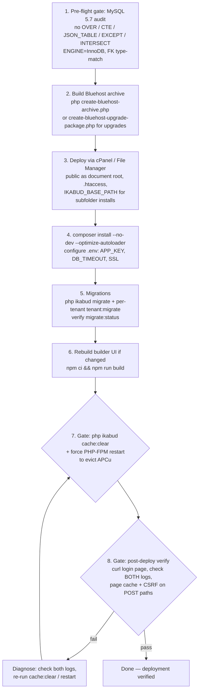

# Production Deployment Guide

**Last updated:** 2026-08-05

## Server Requirements

### Minimum

| Component | Requirement |
|-----------|-------------|
| PHP | 8.2+ (8.3 recommended) |
| Extensions | `pdo_mysql`, `mbstring`, `json`, `openssl`, `curl`, `gd` or `imagick` |
| Optional extensions | `apcu` (strongly recommended for caching), `opcache` |
| MySQL / MariaDB | 8.0+ / 10.6+ |
| Disk | 500 MB application + storage headroom |
| RAM | 256 MB minimum per PHP-FPM worker |

### Recommended Production

| Component | Recommendation |
|-----------|----------------|
| PHP | 8.3 with OPcache + APCu |
| Workers | 4–16 PHP-FPM workers (based on traffic) |
| MySQL | Dedicated instance, InnoDB, `innodb_buffer_pool_size` ≥ 50% of RAM |
| Disk | SSD, 2 GB+ for storage/cache |
| RAM | 1 GB+ total for PHP-FPM pool |

## Directory Structure

```
/var/www/html/yoursite/
├── bootstrap.php          # App bootstrap (env, paths, logging)
├── public/                # Web root (point vhost here)
│   └── index.php          # Entry point
├── kernel/                # Core framework
├── modules/               # Feature modules
├── config/                # Configuration files
├── storage/               # Runtime storage (must be writable)
│   ├── cache/             # File cache tier
│   ├── logs/              # Application + error logs
│   └── uploads/           # User uploads
├── templates/             # DiSyL templates
├── vendor/                # Composer dependencies
└── .env                   # Environment configuration
```

## Environment Configuration

Create `.env` in the project root:

```env
APP_ENV=production
APP_DEBUG=false
APP_KEY=<random-64-char-hex-string>

DB_HOST=127.0.0.1
DB_PORT=3306
DB_DATABASE=ikabud
DB_USERNAME=ikabud_user
DB_PASSWORD=<strong-password>
DB_TIMEOUT_SECONDS=5
DB_PERSISTENT=false
DB_SSL_ENABLED=false
DB_SSL_CA=
DB_SSL_CERT=
DB_SSL_KEY=
DB_SSL_VERIFY_SERVER_CERT=true

# Control plane database (multi-tenant)
CONTROL_DB_HOST=127.0.0.1
CONTROL_DB_DATABASE=ikabud_control
CONTROL_DB_USERNAME=ikabud_control_user
CONTROL_DB_PASSWORD=<strong-password>
CONTROL_DB_TIMEOUT_SECONDS=5
CONTROL_DB_PERSISTENT=false
CONTROL_DB_SSL_ENABLED=false
CONTROL_DB_SSL_CA=
CONTROL_DB_SSL_CERT=
CONTROL_DB_SSL_KEY=
CONTROL_DB_SSL_VERIFY_SERVER_CERT=true

# Cache
CACHE_DIR=storage/cache
CACHE_MAX_SIZE_MB=100

# Logging
LOG_LEVEL=warning
```

**Critical:** `APP_KEY` must be a cryptographically random value. Generate with:
```bash
php -r "echo bin2hex(random_bytes(32));"
```

Set `DB_TIMEOUT_SECONDS` and `CONTROL_DB_TIMEOUT_SECONDS` explicitly during production rollout so the kernel DB manager does not inherit an arbitrary host default. If MySQL transport security is required, enable the matching `*_DB_SSL_*` values together and keep server-certificate verification enabled.

## Web Server Configuration

### Nginx

```nginx
server {
    listen 80;
    server_name yourdomain.com;
    root /var/www/html/yoursite/public;
    index index.php;

    # Security headers are handled by PHP (SecurityHeaders class)
    
    location / {
        try_files $uri $uri/ /index.php?$query_string;
    }

    location ~ \.php$ {
        fastcgi_pass unix:/run/php/php8.3-fpm.sock;
        fastcgi_param SCRIPT_FILENAME $realpath_root$fastcgi_script_name;
        include fastcgi_params;
        fastcgi_read_timeout 60;
    }

    # Deny access to sensitive files
    location ~ /\.(env|git|htaccess) {
        deny all;
    }
    location ~ ^/(bootstrap\.php|composer\.(json|lock)|kernel|modules|config|storage|templates|vendor) {
        deny all;
    }
}
```

### Apache

```apache
<VirtualHost *:80>
    ServerName yourdomain.com
    DocumentRoot /var/www/html/yoursite/public

    <Directory /var/www/html/yoursite/public>
        AllowOverride All
        Require all granted
    </Directory>
</VirtualHost>
```

The project includes `public/.htaccess` for URL rewriting.

## PHP Configuration

### php.ini (production)

```ini
; OPcache
opcache.enable=1
opcache.memory_consumption=128
opcache.interned_strings_buffer=16
opcache.max_accelerated_files=10000
opcache.validate_timestamps=0
opcache.save_comments=1

; APCu
apc.enabled=1
apc.shm_size=64M
apc.ttl=3600

; Security
expose_php=Off
display_errors=Off
log_errors=On
error_log=/var/www/html/yoursite/storage/logs/error.log

; Limits
memory_limit=256M
max_execution_time=30
post_max_size=32M
upload_max_filesize=32M
```

**Important:** `opcache.validate_timestamps=0` requires an OPcache reset on deployment (see below).

## Installation

```bash
# 1. Clone / extract application
cd /var/www/html/yoursite

# 2. Install PHP dependencies
composer install --no-dev --optimize-autoloader

# 3. Set permissions
chown -R www-data:www-data storage/
chmod -R 775 storage/

# 4. Create .env file (see above)
cp .env.example .env
# Edit with production values

# 5. Run database migrations
php scripts/migrate.php

# 6. Build CMS builder UI (if using page builder)
cd modules/cms/builder-ui
npm ci --production=false
npm run build
cd ../../..

# 7. Verify
curl -s http://localhost/login | head -20
```

## Deployment (Updates)

```bash
# 1. Pull code changes
git pull origin main

# 2. Install dependencies
composer install --no-dev --optimize-autoloader

# 3. Run migrations
php ikabud migrate

# 4. Rebuild builder UI (if changed)
cd modules/cms/builder-ui && npm ci && npm run build && cd ../../..

# 5. Clear all runtime caches (DiSyL compiled templates, file cache, APCu)
php ikabud cache:clear

# 6. Reset OPcache (if validate_timestamps=0)
# Option A: Restart PHP-FPM (also evicts any APCu that survived cache:clear)
sudo systemctl restart php8.3-fpm

# Option B: Via PHP script (hit from web)
# php -r "opcache_reset();"

# 7. Verify
curl -sI http://localhost/login
```

### Cache management reference

| Command | Effect |
|---|---|
| `php ikabud cache:clear` | Clears DiSyL compiled templates, file cache, and APCu |
| `php ikabud cache:clear --disyl-only` | Clears only `storage/cache/disyl/` (compiled templates) |
| `php ikabud cache:clear --apcu-only` | Clears only the APCu in-memory cache |

> **When to run `cache:clear`:** Always run after deploying code changes. DiSyL compiled templates are cached on disk and in APCu; stale compiled output can survive a graceful FPM restart without a full `apcu_clear_cache()`. The CLI command handles both layers in one step.

## Bluehost / Shared Hosting Deployment

This chapter is the canonical deployment flow for **Bluehost / cPanel shared hosting** (MySQL 5.7 / Compatibility profile). It complements the Quick Deploy section in [Installation Guide](installation.md) with a full end-to-end gate chain for fresh installs **and** upgrades. See [Database Profiles](database-profiles.md) for the MySQL 5.7 constraints that gate Step 1.

### The Deployment Gate Chain

**Entry point:** a codebase ready to ship (fresh install or upgrade).
**Exit point:** a verified, cache-clean, log-clean live site.

1. **Pre-flight gate — MySQL 5.7 audit.** Run the Compatibility-profile SQL audit before packaging anything:

   ```bash
   grep -rn "OVER()" modules/ src/ kernel/                          # expect nothing
   grep -rn "WITH.*AS\s*(" modules/ src/ kernel/ --include="*.php"  # expect nothing (non-CTE like WITH GRANT OPTION is fine)
   ```

   Also confirm: every migration `CREATE TABLE` ends with `ENGINE=InnoDB DEFAULT CHARSET=utf8mb4 COLLATE=utf8mb4_unicode_ci`, FK column types match referenced columns exactly (signedness + width), and there is no `JSON_TABLE()`, `EXCEPT`, or `INTERSECT`. **Do not proceed until the audit is clean.**

2. **Build the Bluehost archive** (from the repo root, locally):

   ```bash
   php create-bluehost-archive.php                     # fresh-install ZIP
   # optional custom filename:
   php create-bluehost-archive.php my-release.zip
   ```

   Default output: `application-kernel-os-YYYYMMDD-HHmmss.zip` in the project root. It bundles `kernel/`, `src/`, `config/`, `public/` (including the `lock.php` installer), `modules/`, `templates/`, `database/` + `migrations/` + `control-migrations/`, `vendor/`, `.htaccess`, `.env.example`, the `ikabud` CLI, and `scripts/`. It **excludes** `.env`, `storage/logs/*`, `storage/cache/*`, `storage/backups/*`, `.git/`, `.github/`, `docs/`, `tests/`, `node_modules/`, and the mobile `android/` client.

   **For upgrades** of an already-running Bluehost site, generate the **upgrade kit** instead, which bundles the deployment archive plus importable SQL bundles (primary, control, and tenant DBs) and a `README-UPGRADE.txt`:

   ```bash
   php create-bluehost-upgrade-package.php              # bluehost-upgrade-kit-YYYYMMDD-HHmmss.zip
   ```

   > These two scripts previously had **no run instructions anywhere** (roadmap.md only referenced them); they are documented for the first time here. The upgrade kit is the recommended production upgrade path — see [Installation Guide — Bluehost Upgrade Kit](installation.md).

3. **Deploy via cPanel / File Manager.** Upload the archive and extract under `public_html/` (or a subfolder such as `public_html/kernelappos/`). Key points:
   - The **document root is `public/`** — point the domain at `public_html/<app>/public` (via subdomain doc root or the root `.htaccess` rewrite pattern).
   - Keep `public/.htaccess` in place (front-controller rewrite). For a subfolder install where the primary domain must stay on `public_html/`, add the root `.htaccess` rewrite + `SetEnv IKABUD_BASE_PATH /` — see [Installation Guide — cPanel Primary Domain Serving A Tenant CMS](installation.md) for the exact block.
   - For fresh installs, run the web installer at `https://yourdomain.com/lock.php` (enter app + control DB credentials), then **delete `public/lock.php`**. Do **not** use `lock.php` as the upgrade path for an existing production site — use the upgrade kit flow.

4. **Install dependencies + configure `.env`.**

   ```bash
   composer install --no-dev --optimize-autoloader
   cp .env.example .env   # then edit production values
   ```

   `.env` essentials for Bluehost:
   - `APP_KEY` — random 64-char hex (`php -r "echo bin2hex(random_bytes(32));"`)
   - `APP_ENV=production`, `APP_DEBUG=false`
   - `DB_TIMEOUT_SECONDS` / `CONTROL_DB_TIMEOUT_SECONDS` set explicitly (do not inherit a host default)
   - `*_DB_SSL_ENABLED=true` only after CA/client cert paths exist on disk; keep `*_DB_SSL_VERIFY_SERVER_CERT=true`
   - Set permissions: `chmod -R 775 storage/` (and `public/`)

5. **Run migrations.** Base/control DB first, then each tenant DB:

   ```bash
   php ikabud migrate                  # primary app DB (+ migrate:control for the control DB)
   php ikabud tenant:migrate <tenant_id|tenant_key|domain> [module]   # per tenant DB
   php ikabud migrate:status           # verify nothing is left pending
   ```

   See [Migration Workflow](migration-workflow.md) for the tenant-vs-base decision and the "Nothing to migrate" registration gotcha.

6. **Rebuild the builder UI if changed.**

   ```bash
   cd modules/cms/builder-ui
   npm ci
   npm run build
   cd ../../..
   ```

   Skip only if the page builder UI did not change in this deploy.

7. **Gate — clear caches + force PHP-FPM restart.** Compiled DiSyL templates are APCu-cached and **survive graceful FPM restarts**, so clear explicitly:

   ```bash
   php ikabud cache:clear        # DiSyL compiled templates + file cache + APCu
   ```

   Then **force-stop** PHP-FPM (not graceful) to evict any APCu that survived `cache:clear`: `sudo systemctl restart php8.3-fpm` (or use the hosting panel's PHP version restart). With `opcache.validate_timestamps=0`, this restart also resets OPcache.

8. **Gate — post-deploy verify.**
   - `curl -sI https://yourdomain.com/login` — expect `200` and expected security headers.
   - Check **BOTH logs**: `storage/logs/app.log` **and** `storage/logs/error.log` — no new errors after the first real page loads.
   - Confirm **page cache + CSRF**: POST/CSRF-bearing public paths must be in `PAGE_CACHE_SKIP_PREFIXES` (defined in `src/helpers/page-cache.php`, list in `config/page-cache-prefixes.php`) so a cached GET never serves a stale CSRF token to POST forms. If any CSRF-bearing path is missing, add it and re-clear the cache.



### Bluehost-specific notes

- **MySQL 5.7 / Compatibility profile is the production baseline.** All SQL must follow the rules in [Database Profiles](database-profiles.md); the pre-flight grep in Step 1 enforces it.
- **`public/` is the web root.** Never serve from the repo root; the `.htaccess` denies access to `.env`, `bootstrap.php`, `kernel/`, `modules/`, `config/`, `storage/`, `templates/`, and `vendor/`.
- **APCu survives graceful FPM restarts.** Always pair `php ikabud cache:clear` with a force restart after template/layout changes.
- **Upgrade path:** use a freshly generated `create-bluehost-upgrade-package.php` kit, import the guarded SQL bundles (app → control → tenant) before uploading code, preserve live `.env`/`storage/`/`public/uploads/`, then follow Steps 3–8. See [Installation Guide — Bluehost Upgrade Kit](installation.md).

## Monitoring

### Log Files

| Log | Path | Content |
|-----|------|---------|
| Application | `storage/logs/app.log` | Business-level events, warnings, request IDs |
| PHP Errors | `storage/logs/error.log` | PHP errors, exceptions, fatals |

Both logs include `X-Request-Id` for correlation.

### Key Metrics to Monitor

| Metric | How to Check | Alert Threshold |
|--------|-------------|-----------------|
| PHP-FPM status | `/status` endpoint or `pm.status_path` | Active workers > 80% of max |
| OPcache usage | `opcache_get_status()` | Memory > 90% |
| APCu usage | `apcu_cache_info()` | Memory > 80% |
| File cache size | `du -sh storage/cache/` | Near `CACHE_MAX_SIZE_MB` |
| Error log growth | `wc -l storage/logs/error.log` | New errors per minute > 0 |
| MySQL connections | `SHOW PROCESSLIST` | Near `max_connections` |

### Cache Statistics

```php
// Via application
$stats = app()->cache()->stats();
// → ['hits' => ..., 'misses' => ..., 'size' => ..., 'entries' => ...]
```

## Backup Strategy

### Database

```bash
# Daily full backup
mysqldump --single-transaction --routines --triggers \
  -u backup_user -p ikabud > /backups/ikabud_$(date +%Y%m%d).sql

# Control plane (if multi-tenant)
mysqldump --single-transaction \
  -u backup_user -p ikabud_control > /backups/control_$(date +%Y%m%d).sql
```

### Files

```bash
# Application files (exclude vendor, node_modules, cache)
tar czf /backups/app_$(date +%Y%m%d).tar.gz \
  --exclude='vendor' \
  --exclude='node_modules' \
  --exclude='storage/cache' \
  /var/www/html/yoursite/

# User uploads only
tar czf /backups/uploads_$(date +%Y%m%d).tar.gz \
  /var/www/html/yoursite/storage/uploads/
```

## Security Checklist

- [ ] `.env` is not accessible via web (nginx/apache deny rules)
- [ ] `APP_DEBUG=false` in production
- [ ] `APP_KEY` is set to a random value (not the example)
- [ ] `storage/` directory is not web-accessible
- [ ] `kernel/`, `modules/`, `config/` are not web-accessible
- [ ] PHP `display_errors=Off`
- [ ] HTTPS enforced (via web server or load balancer)
- [ ] Database user has minimal required privileges
- [ ] File permissions: `www-data` owns `storage/`, no world-writable files
- [ ] OPcache `validate_timestamps=0` with controlled deployments
- [ ] Security headers active (managed by `kernel/Http/SecurityHeaders.php`)

## Troubleshooting

| Symptom | Likely Cause | Fix |
|---------|-------------|-----|
| Blank page | `APP_KEY` not set or wrong | Check `.env`, set correct key |
| 500 error | PHP error hidden by `display_errors=Off` | Check `storage/logs/error.log` |
| Styles broken | Builder UI not built | Run `npm run build` in `modules/cms/builder-ui` |
| Login broken | CSP headers blocking scripts | Check `SecurityHeaders` config, ensure `unsafe-eval` present |
| Cache stale | OPcache not cleared | Restart PHP-FPM or call `opcache_reset()` |
| Slow pages | APCu not installed | Install `php-apcu` extension |
| Module missing | Module not enabled for tenant | Check control plane settings |
